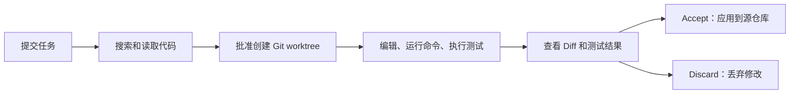
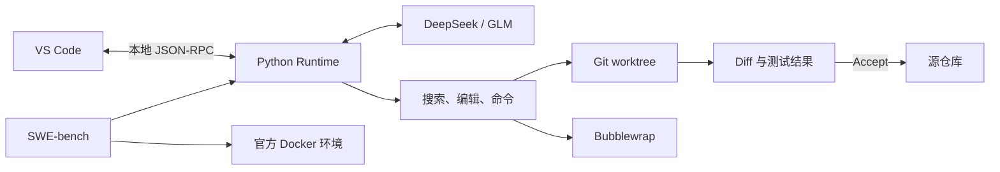

# CodeAgent

**在 VS Code 中运行的本地 Coding Agent。修改先隔离，过程可查看，交付由你决定。**

CodeAgent 可以搜索和编辑代码。它也可以运行项目命令和测试。

执行过程显示在 VS Code 右侧栏。

- 修改先进入独立的 Git worktree，不会直接写入源仓库。
- 任务中的消息、工具调用和测试状态可以随时查看。
- 完成后先审查原生 Diff，再选择 Accept 或 Discard。

VS Code Extension 提供界面。Python Runtime 在本地调用模型和工具。

当前 `0.5.0` 仍处于发布候选阶段，支持 Linux 和 WSL2。HAL 固定 50 题正式评测仍待完成。
进度见[发布验收](docs/RELEASE_VALIDATION.md)。

## 产品预览

<p align="center">
  <a href="docs/assets/showcase/overview.png">
    
  </a>
</p>

CodeAgent 在隔离工作区中完成修改和验证。开发者可以查看执行结果与原生 Diff，
再决定是否把修改应用到源仓库。

<table width="100%">
  <tr>
    <td width="33%" valign="top">
      <a href="docs/assets/showcase/approval.png">
        
      </a>
    </td>
    <td width="33%" valign="top">
      <a href="docs/assets/showcase/discard.png">
        
      </a>
    </td>
    <td width="33%" valign="top">
      <a href="docs/assets/showcase/history.png">
        
      </a>
    </td>
  </tr>
  <tr>
    <td valign="top"><strong>受保护操作先审批</strong><br>界面说明原因，并等待用户决定。</td>
    <td valign="top"><strong>修改可以丢弃</strong><br>Discard 后，源仓库保持不变。</td>
    <td valign="top"><strong>会话保存在本地</strong><br>重载窗口后仍可恢复任务。</td>
  </tr>
</table>

## 为什么做 CodeAgent

让模型写出一段代码，只是 Coding Agent 的一部分。真实任务还要运行项目命令、处理长时间执行，
并保护用户正在工作的仓库。

CodeAgent 关注任务如何安全运行。项目命令只有在明确权限内才能执行。

CodeAgent 也会控制模型看到的历史，避免工具输出无限增长。

测试结果会跟随对应的代码修改，避免旧结果被误用。

用户可以看到任务为何等待或停止。最终修改只有在用户审查后，才会应用到源仓库。

## 一次任务如何完成



源仓库需要有 Git commit，并且工作目录必须干净。

第一次需要修改时，CodeAgent 会请求创建隔离 worktree。
第一次运行项目命令时，也会触发这个请求。

命令默认不能联网，也只能写入为任务准备的目录。确实需要额外权限时，界面会显示单独的审批请求。

命令失败时，时间线会显示退出状态和关键错误。完整输出可以按需展开。

Runtime 对较早历史做语义压缩或从模型输出截断中恢复时，时间线会显示简洁的 System 状态；这些内容不会伪装成
Agent 回复或隐藏推理。

Accept 后，文件列表和当时的 Diff 仍可查看。之后的手工修改不会混入这份历史 Diff。

每个请求还有模型调用上限。达到上限后，CodeAgent 会等待用户决定是否继续。

项目还使用 SWE-bench 检查真实修复任务。SWE-bench 是一个开源代码修复基准。

## Engineering Highlights

### 1. 在受控环境中运行项目命令

真实编码任务常常需要组合 shell 命令。如果直接给 Agent 宿主机 shell，一条错误命令就可能修改用户文件，
或把项目数据发送到网络。

CodeAgent 先用 Git worktree 隔离代码修改。每条命令再通过 Bubblewrap sandbox 运行。
命令默认断网，并且只能写入指定范围。
额外的网络或文件写入需要用户批准。

因此，Agent 可以运行真实的构建和测试命令。它不会默认获得整个宿主机的写权限。
如果 sandbox 无法启动，命令会被拒绝。

宿主文件仍可能被只读访问。当前也没有 CPU 或内存配额。完整边界见[安全模型](docs/SECURITY.md)。

### 2. 控制长任务的上下文大小

一次编码任务可能产生大量搜索结果、文件内容和测试输出。如果全部历史一直加入模型请求，
上下文会越来越大，也更容易包含过期信息。

CodeAgent 会在每次调用模型前重新整理上下文。它保留当前请求和近期工具结果，
并重新读取当前修改与测试状态。较早的工具正文会逐步缩减。

因此，长任务不会只是不断追加完整聊天记录。模型每一步都能看到当前工作区的关键事实。

当前使用连续 CCES raw tail 和 rolling semantic summary；最低上下文仍无法容纳时会停止并保留现场。
详细现状见[当前架构](docs/ARCHITECTURE.md)；完整的连续事件窗口和语义压缩规则见
[上下文管理技术设计](docs/CONTEXT_MANAGEMENT_TECHNICAL_DESIGN.md)。

### 3. 让测试结果对应当前代码

Agent 跑完测试后还可能继续修改代码。此时刚才的“测试通过”已经不能证明当前代码仍然正确。

CodeAgent 会把测试结果和当时那份修改绑定。代码继续变化后，界面会把旧结果标记为过期，
并要求重新测试。

因此，用户在 Accept 前可以看到当前 Diff。旁边的测试状态也对应这份修改。
系统不会拿旧版本的成功记录代表新版本。

CodeAgent 的 validation 命令使用 Bash `pipefail`，避免测试管道前段失败被末端输出命令掩盖；它仍只能证明指定命令
成功退出，不能判断测试是否充分。用户合入并发修改后，也应按需重新测试。
详见[产品使用流程](docs/PRODUCT.md)。

### 4. 让执行过程可见、可停止

长任务如果只显示“正在运行”，用户就不知道 Agent 正在做什么。
它可能在读文件、跑命令，或等待权限。
任务失控时，用户也需要一个明确的停止入口。

CodeAgent 在 VS Code 中展示消息和工具调用。命令、审批和测试也有各自的状态。
每个请求还有明确的模型步骤上限；到达上限后，需要用户决定是否增加预算。

因此，用户能看到任务为什么停住。用户可以拒绝权限、停止任务，或明确允许它继续运行。

Stop 会在当前模型调用或工具操作结束后生效。它不会立即中断已经运行的命令。
状态说明见[产品使用流程](docs/PRODUCT.md)。

### 5. 记录可复查的 SWE-bench 评测

如果每次评测使用不同题目或环境，两次结果就很难直接比较。
只报告一个通过率，也无法解释失败来自模型还是运行环境。

CodeAgent 每次固定 SWE-bench 题集和官方 Docker 镜像。
运行时还会记录模型版本、代码版本、token 用量和成本。最后由官方评分程序（grader）判断结果。

因此，评测结果可以追溯到明确的运行条件。模型完成、测试通过和 grader 通过会分别记录。

当前还没有分阶段时延报告。HAL SWE-bench Verified Mini 50 题运行保持 **pending**。
详见[评测方法](docs/BENCHMARKING.md)和[评测结果](docs/EVALUATION_RESULTS.md)。

## Quick Start：源码体验

### 1. 安装 Runtime

Ubuntu / WSL2：

```bash
sudo apt-get update
sudo apt-get install -y bubblewrap ripgrep python3-venv git

git clone https://github.com/YeYan0829/codingAgent.git
cd codingAgent
python3 -m venv .venv
.venv/bin/python -m pip install -e ".[dev]"
.venv/bin/codeagent --help
```

Python 需要 3.11 或更高版本。完整界面需要 VS Code 1.106 或更高版本。
Docker 只用于 SWE-bench。

### 2. 验证 Runtime

Fake provider 是用于安装检查的固定响应程序。下面的命令不需要 API Key 或网络。

```bash
.venv/bin/codeagent ask . "只读取 README，并用三句话概括项目"
```

Fake provider 不能修改代码，也不代表真实模型能力。

### 3. 体验 VS Code 流程

先创建离线演示仓库：

```bash
.venv/bin/codeagent-product-demo --root /tmp/codeagent-product-demo
cd /tmp/codeagent-product-demo
python3 verify.py
```

`verify.py` 应以 `ZeroDivisionError` 失败。这个步骤不需要网络。

然后用 VS Code 打开 CodeAgent 源码仓库。按 `F5`，选择 **Run CodeAgent Extension**。
随后会打开新的 VS Code 窗口。这个窗口叫 Extension Development Host。
在其中打开 `/tmp/codeagent-product-demo`。

在右侧 CodeAgent 中配置模型和 API Key，再发送：

模型设置页还可以启用 reasoning，并选择该模型支持的推理档位。这个设置只影响之后新建的会话。

```text
修复零数量时的错误，运行仓库中的验证脚本并总结修改。
```

任务完成后，查看测试状态和原生 Diff。然后选择 Accept 或 Discard。
真实模型请求可能产生费用。

当前 VSIX 不包含 Python Runtime。独立安装方式见[安装与运行](docs/INSTALLATION.md)。

## 架构概览



更详细的数据流见[当前架构](docs/ARCHITECTURE.md)。

## 示例与评测

[`examples/showcase/`](examples/showcase/) 提供最小离线示例。
[`examples/eval-tasks/`](examples/eval-tasks/) 提供三个可重复的真实仓库任务。

README 顶部的截图来自这个离线示例，可以直接复现同一条修复流程。

这些示例不是 SWE-bench 官方成绩。已有评测仅用于验证运行链路。
HAL SWE-bench Verified Mini 固定 50 题尚未运行，也没有预测成绩。

## 当前限制

- 仅支持 Linux、WSL2 和本地 Git 仓库。
- 源仓库必须有 commit，工作目录必须干净。
- 本地命令默认断网；额外网络或写入需要审批。
- Bubblewrap 不可用时，命令功能不可用。
- 当前没有资源配额、域名白名单或通用 secret 扫描。
- Runtime 不会判断测试是否充分，也不会自动解决 Git 冲突。
- Accept 后可以回看修改，但当前不提供一键撤销。

更多限制见[安全模型](docs/SECURITY.md)。

## 文档

| 文档 | 适合解决的问题 |
| --- | --- |
| [安装与运行](docs/INSTALLATION.md) | 如何安装 Runtime 和 Extension |
| [产品使用流程](docs/PRODUCT.md) | 任务执行时可以看到什么、做什么 |
| [当前架构](docs/ARCHITECTURE.md) | Runtime 如何管理上下文、工具和修改 |
| [上下文管理技术设计](docs/CONTEXT_MANAGEMENT_TECHNICAL_DESIGN.md) | 当前 CCES、连续 raw tail、rolling semantic summary 与预算 contract |
| [安全模型](docs/SECURITY.md) | sandbox 能保护什么，不能保护什么 |
| [Product RPC](docs/RPC.md) | Extension 如何与 Runtime 通信 |
| [Benchmark 说明](docs/BENCHMARKING.md) | SWE-bench 如何运行和记录证据 |
| [评测结果](docs/EVALUATION_RESULTS.md) | 哪些结果已经确认，哪些仍 pending |
| [测试](docs/TESTING.md) | 每组自动化测试证明什么 |
| [发布验收](docs/RELEASE_VALIDATION.md) | 当前距离发布还缺什么 |

## License

[MIT](LICENSE)
