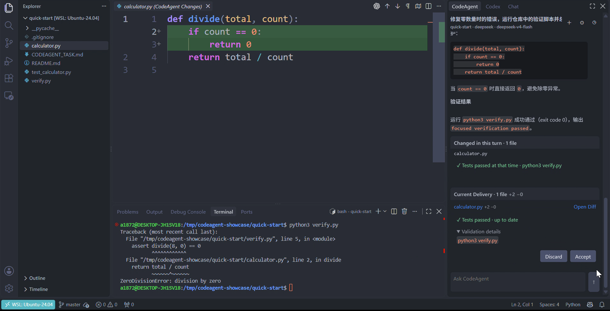
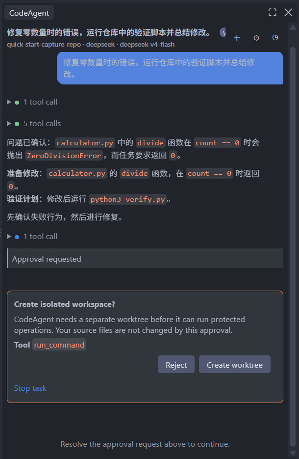
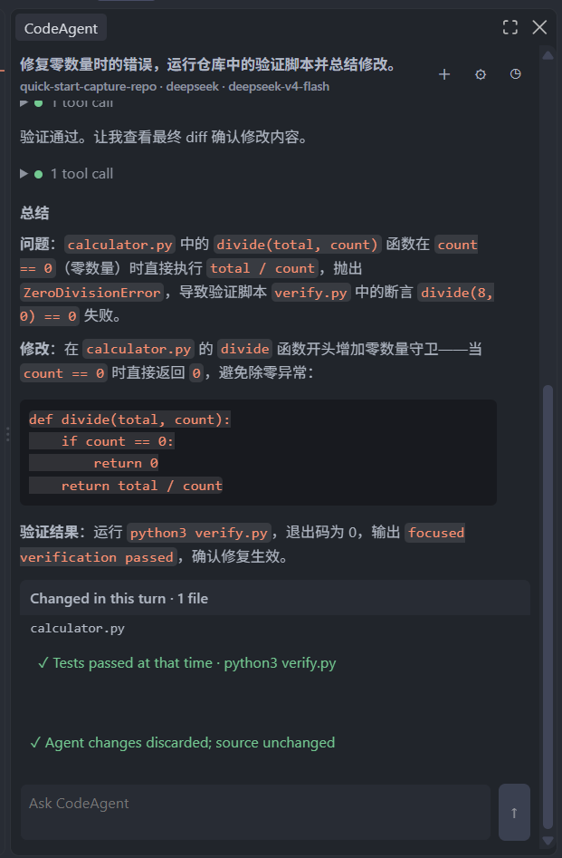
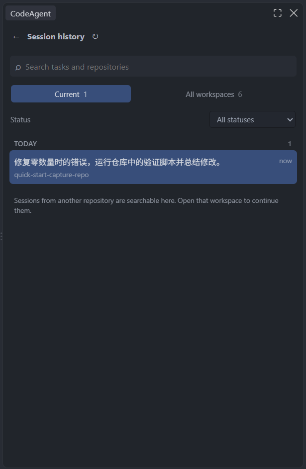
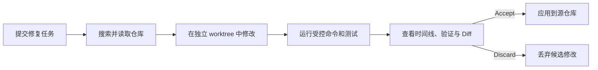
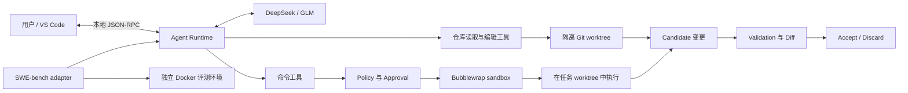

# CodeAgent

**一个在本地运行的 Coding Agent Runtime：让模型检查、修改并验证真实 Git 仓库，同时把变更隔离在源工作区之外。**

CodeAgent 将代码搜索、受控命令执行、隔离修改、验证和人工交付串成完整流程。模型生成的改动先进入独立 Git
worktree；开发者可以在 VS Code 中查看时间线、测试状态和原生 Diff，再选择 Accept 或 Discard。

当前版本为 `0.5.0`，支持 Linux 和 WSL2。

<p align="center">
  <a href="docs/assets/showcase/overview.png">
    
  </a>
</p>

<table width="100%">
  <tr>
    <td width="33%" valign="top">
      <a href="docs/assets/showcase/approval.png">
        
      </a>
    </td>
    <td width="33%" valign="top">
      <a href="docs/assets/showcase/discard.png">
        
      </a>
    </td>
    <td width="33%" valign="top">
      <a href="docs/assets/showcase/history.png">
        
      </a>
    </td>
  </tr>
  <tr>
    <td valign="top"><strong>危险操作先审批</strong><br>界面说明权限和原因，由用户决定是否继续。</td>
    <td valign="top"><strong>修改可以丢弃</strong><br>Discard 删除候选工作区，不改动源仓库。</td>
    <td valign="top"><strong>过程可以复查</strong><br>消息、工具、验证和交付状态保存在本地。</td>
  </tr>
</table>

## 快速开始

### 安装发布产物

需要 Python 3.11+、Git、ripgrep、Bubblewrap，以及 VS Code 1.106+。Docker 只用于 SWE-bench，不是本地产品依赖。

从项目的 GitHub Release 下载同为 `0.5.0` 的 wheel 和 VSIX，然后安装 Runtime：

```bash
python3 -m venv "$HOME/.local/share/codeagent/venv"
"$HOME/.local/share/codeagent/venv/bin/python" \
  -m pip install ./codeagent_runtime-0.5.0-py3-none-any.whl
"$HOME/.local/share/codeagent/venv/bin/codeagent" --help
```

在 VS Code 中执行 **Extensions: Install from VSIX...**，选择 `codeagent-0.5.0.vsix`。随后把设置
`codeagent.rpcCommand` 指向上面虚拟环境中的 `codeagent-rpc` 绝对路径。VSIX 不捆绑 Python Runtime。

打开一个已有 commit 且工作目录干净的 Git 仓库，在右侧 CodeAgent 中配置 Provider 和 API Key，然后提交任务：

```text
定位这个失败测试的原因，完成修复并运行相关验证。
```

API Key 保存在 VS Code SecretStorage 中。真实模型调用可能产生费用；项目命令默认不能联网。

### 无 API Key 安装检查

内置 Fake provider 可以检查 Runtime、Session 和只读工具链，不会修改仓库：

```bash
"$HOME/.local/share/codeagent/venv/bin/codeagent" ask . \
  "只读取 README，并用三句话概括项目"
```

从源码开发、配置 DeepSeek/GLM、运行离线修复示例和排错步骤见[安装与运行](docs/INSTALLATION.md)。

## 一次任务如何完成



第一次需要编辑或运行项目命令时，CodeAgent 请求创建隔离工作区。后续修改和验证都发生在该 worktree 中；源仓库在
Accept 前保持不变。Accept 还会检查源仓库是否仍与任务开始时兼容，避免静默覆盖并发修改。

VS Code Extension 不只是聊天界面：它显示 Agent 时间线、工具状态、审批、当前验证证据、原生 Diff、任务预算和本地历史。
任务可以停止；达到模型步骤上限时，现场和候选修改会保留，等待用户决定。

## 工程设计重点

### 隔离真实仓库修改

CodeAgent 为需要修改仓库的 Session 创建独立 Git worktree，把变更组织成可检查的 Candidate。验证结果绑定到对应的文件树；
开发者审查 Diff 后再 Accept 或 Discard。Accept 前会重新核对源仓库状态，遇到冲突时停止而不是强行覆盖。

### 控制项目命令的执行边界

模型需要运行测试和构建命令，但不会直接获得 unrestricted host shell。本地产品通过 policy 和 approval 判断权限，再在
Bubblewrap sandbox 中执行命令；默认关闭网络，并限制可写位置。Bubblewrap 不可用时，命令会被拒绝。

SWE-bench 使用独立 Docker backend 提供官方项目环境。Docker 是评测适配器，不代表本地产品的每条命令都运行在容器中。
两种环境的具体边界见[安全模型](docs/SECURITY.md)和[命令环境](docs/COMMAND_ENVIRONMENT_CONTRACT.md)。

### 让交付过程可审查

Runtime 将消息、工具调用、审批、验证和交付状态记录为结构化事件，VS Code 据此构建可复查的任务时间线。开发者可以查看
当前修改和原生 Diff，再选择 Accept 或 Discard；底层压缩和截断恢复只显示为简短系统提示。

### 支持较长的工具调用链

长任务会积累搜索结果、文件内容和测试输出。Runtime 保留近期工具交换，将更早的历史压缩为工作摘要，并重新注入当前
workspace、Candidate 和验证状态。模型响应被截断时会进行有界续接；任务也受明确的步骤预算约束。具体顺序、窗口和停止
边界见[上下文管理](docs/CONTEXT.md)。

## 架构概览



CLI、VS Code 和 SWE-bench adapter 共用同一 Agent loop、工具注册、上下文与 Candidate 语义；产品交互和 benchmark 环境保持
各自边界。模块职责和事件数据流见[当前架构](docs/ARCHITECTURE.md)。

## 真实仓库评测

`0.5.0` 在固定的 **HAL SWE-bench Verified Mini 50** 上完成了一次干净候选提交的端到端评测：

| 指标 | 结果 |
| --- | ---: |
| Official grader resolved | **35 / 50（70%）** |
| Easy / Medium / Hard | 16/20 · 17/24 · 2/6 |
| 产生非空补丁 | 50 / 50 |
| 在 72-step 预算内正常结束 | 48 / 50 |
| Provider / infrastructure error | 0 / 0 |
| Model-step budget exhausted | 2 |

固定条件为 GLM-5.3、reasoning `high`、temperature `1.0`、单次输出上限 8,192 token、每题最多 72 个主模型步骤。评测
候选 commit 为 `932b52ffff4209a748c6646a056d2ab43111637e`。

这项结果证明 Runtime 能够承载完整的 repository-level bug-fixing workload，不代表 SOTA，也不能把单次采样分数单独解释为
Runtime 或基础模型能力。失败审计中，多数未解决任务来自不完整或语义错误的补丁；两题耗尽步骤预算，一题因预测补丁与官方
测试补丁冲突而无法应用。7 次语义压缩流程均正常完成；在抽查的压缩轨迹中没有识别到由上下文丢失直接造成的失败，但这不证明
压缩对所有任务成功率没有影响。

完整方法、失败分类、token/成本和限制见[评测结果](docs/EVALUATION_RESULTS.md)，机器可读摘要见
[HAL Mini 50 发布证据](docs/evidence/v0.5.0-hal-mini-50.json)。

## 当前边界

- 仅支持 Linux、WSL2 和本地 Git 仓库；源仓库需要至少一个 commit，且工作目录必须干净。
- 本地命令依赖可用的 Bubblewrap；当前没有 CPU/内存配额、域名白名单或通用 secret 扫描。
- Runtime 只能记录指定验证命令是否成功，不能判断测试是否充分。
- VSIX 不包含 Runtime；wheel 与 VSIX 必须分别安装并保持版本一致。
- 当前不会自动解决 Accept 时的 Git 冲突，也不提供 Accept 后的一键撤销。
- 模型和项目命令可能产生外部费用或修改隔离工作区，仍需审查最终 Diff。

## 文档与开发

| 文档 | 内容 |
| --- | --- |
| [安装与运行](docs/INSTALLATION.md) | 系统要求、模型配置、wheel/VSIX 安装与排错 |
| [产品使用流程](docs/PRODUCT.md) | Timeline、审批、验证、Diff 与 Accept/Discard |
| [当前架构](docs/ARCHITECTURE.md) | Runtime 数据流、模块职责和状态边界 |
| [上下文管理](docs/CONTEXT.md) | 压缩、近期原文窗口、reasoning 与预算 contract |
| [安全模型](docs/SECURITY.md) | worktree、sandbox、权限与剩余风险 |
| [评测方法](docs/BENCHMARKING.md) | 固定题集、Docker、grader、恢复和记账 |
| [评测结果](docs/EVALUATION_RESULTS.md) | HAL50 正式结果、失败归因与限制 |
| [测试说明](docs/TESTING.md) | 自动化测试分别证明什么 |
| [Changelog](CHANGELOG.md) | `0.5.0` 面向用户的变更 |

开发安装：

```bash
git clone https://github.com/YeYan0829/codingAgent.git
cd codingAgent
python3 -m venv .venv
.venv/bin/python -m pip install -e ".[dev]"
.venv/bin/python -m pytest
```

## License

[MIT](LICENSE)
