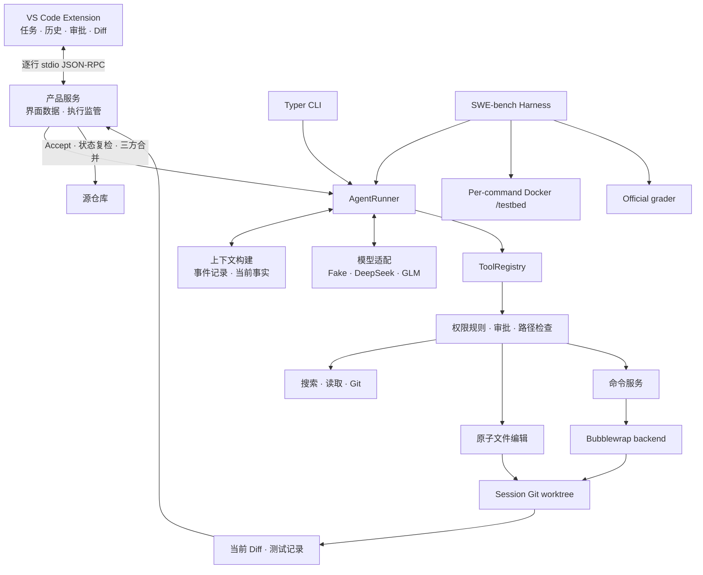

# 当前架构

本文描述 `0.5.0` 发布候选代码已经实现的系统。接口事实以源码和自动化测试为准。

## 阅读约定

本页需要使用少量内部名称。先给出它们的普通含义：

- **Session**：绑定一个源仓库的持久会话。
- **Candidate**：Agent worktree 中尚未交付的修改，中文称“待审查修改”。
- **baseline**：上一次已经接受的代码状态，用来计算下一份 Diff。
- **validation evidence**：某条测试命令对某一份代码成功执行的记录。
- **identity**：用于确认文件、仓库或运行配置仍是原来对象的一组客观值。
- **UserTurn**：一条真实用户请求。
- **ModelStep**：一次模型响应。
- **ToolExchange**：一次工具调用，以及对应的成功、失败或拒绝结果。
- **current / stale**：测试记录仍对应当前修改时为 current；代码变化后为 stale。

后文首次出现其他内部状态时，会在原地说明含义。

## 高层结构



本地产品和 benchmark 共用 AgentRunner、工具与待审查修改规则。

benchmark 只替换命令执行环境。它不替换宿主 Git worktree，也不经过 VS Code 的人工 Accept 流程。

## 模块职责

| 模块 | 当前职责 |
| --- | --- |
| `codeagent/session/` | Session metadata、append-only Event、全局索引与恢复 |
| `codeagent/context/` | 从事件重建模型上下文、加入当前运行事实并控制输入大小 |
| `codeagent/model_gateway/` | Fake、DeepSeek、GLM adapter 和 usage 标准化 |
| `codeagent/tools/` | 模型工具 schema、ToolRegistry、search/read/Git 工具 |
| `codeagent/runtime/` | Agent loop、Policy、Approval、原子编辑、命令、Candidate、validation |
| `codeagent/workspace/` | source/active identity 和 Git worktree 生命周期 |
| `codeagent/product/` | Product Application Service、Read Model、执行监管和 stdio RPC |
| `vscode-extension/` | 右侧栏 UI、SecretStorage、RPC client、原生 Diff document |
| `codeagent/benchmark/` | SWE-bench source、Docker executor、preflight、batch、grader 与报告事实 |

模型发起的工具调用通过 ToolRegistry，再进入对应 Policy 和服务。用户 Accept/Discard 走 Product Service，
benchmark 的环境准备和 grader 由 harness 调度；这些宿主操作不是模型工具，也不由 Bubblewrap 统一包围。

## 从用户请求到执行状态

一个 Session 保存模型配置、事件和工作区状态。一条用户请求可以包含多次模型调用。

每次模型调用又可能发起多个工具。持久化层用以下名称关联它们，产品 UI 不要求用户理解这些对象。

```text
Session
└── UserTurn：一条真实用户请求
    ├── ModelStep：一次 provider 响应
    └── ToolExchange：模型工具调用及其 terminal result/denial
```

Event 是一条持久化事件记录，同时保存 `turn_id` 和 `model_step_id`。

只有真实用户输入创建 UserTurn。内部执行切片的自动续跑不会新增用户消息。

每个切片默认最多 12 个 ModelStep。每个 UserTurn 默认总上限为 48。
总上限耗尽后，Runtime 等待用户明确扩额或 Stop。

## Agent Runtime 与上下文

`AgentRunner` 在每个 ModelStep 前从当前事实重新构建请求：

```text
events.jsonl
→ UserTurn / ModelStep / ToolExchange projection
→ 当前 Workspace、Candidate、validation、command environment snapshot
→ 最近有界 Tool Observation 与历史 residue
→ token budget reduction
→ provider request
```

每轮保留当前用户请求，用 Git 和 Session metadata 更新 active workspace、changed paths、baseline、validation
和实际命令环境。预算由 Runtime 单独执行；后续内部切片通过临时控制消息告知模型已用步骤和当前上限，
并非 Runtime Snapshot 自带全部预算字段。

预算估算同时计算消息和工具 schema，并预留输出、续跑和安全余量。先减少保留正文的近期工具步骤，再整轮移除
已完成的旧请求；工具调用和 terminal result 始终配对。旧正文降级为访问记录，源码需要时再次读取。
当前轮的工具调用参数仍然保留，长参数或过长用户输入仍可能撑满最低集合；旧轮次被移除后也不保证保留其全部约束。
估算器按 UTF-8 大小估计 token，并非 provider 的精确 tokenizer。最低必需集合仍超限时，Runtime 写入
`context_budget_exceeded` 并保留 Session 与 workspace。当前没有 semantic condensation、自动 Working Set、
RepoMap 或 RAG。

每个 provider 响应另写 `model_usage` Event，记录可获得的 token 和 provider request id。usage 不进入后续模型
上下文，也不计作一个 ModelStep。

## 工具与工作区升级

Session 从 `source_only` 开始。Search、Read 和只读 Git 工具针对 active workspace；第一次编辑或受控命令触发
workspace approval：

```text
source_only → preparing_workspace → changes_active
```

允许后，Runtime 检查源目录是 Git 根目录、有 HEAD 且没有 tracked 修改或 untracked 文件，
再创建 detached Git worktree 并重新构建工具服务。ignored 文件不随 Git worktree 自动复制。后续读取、编辑、命令和验证都针对该 worktree。
拒绝时 source 保持不变，本轮不会反复申请同一次 workspace upgrade。

`apply_workspace_edit` 是唯一通用编辑入口，支持受约束的 UTF-8 create/replace/delete/move。已有文件操作需要最近
读取的 SHA，整个 operations 数组先 prepare 后事务提交；无法证明回滚时进入 `recovery_required`。

## Command execution

`run_command` 接受 shell string，但宿主以 `shell=False` 启动固定的：

```text
/bin/bash --noprofile --norc -c <command>
```

每次调用都有新的 Bubblewrap 和 fresh shell。`EffectiveCommandEnvironment` 同时驱动真实进程环境、Runtime
Snapshot 和结果 provenance。Runtime 不解析 shell 语义、不自动修正命令、不自动安装依赖。

每条真实启动的命令都有 before/after Git audit。非零退出或 timeout 本身不会 taint；只有进程边界或执行后
workspace 状态无法确认时才进入 `workspace_tainted` 或 `recovery_required`。详细权限见[安全模型](SECURITY.md)。

## Candidate、validation 与 Accept

worktree HEAD 是最近 accepted baseline，working tree 是当前 pending changes。原子编辑和命令产生的文件变化都会
推进 `candidate_revision`。

`run_command(purpose="validation")` 成功时记录执行证据。`current_validation_evidence` 查找状态为 passed、
workspace revision、base commit 与当前 subject tree 相同的记录，不以 `candidate_revision` 单独判定新鲜度。
文件树不同则旧证据 stale；恢复到同一树且其他身份相同，底层可再次使用旧成功证据。
Product Read Model 另以最近 validation 命令及其 candidate_revision 展示状态和控制按钮，口径并不完全相同；
UI 可用性不能代替 Accept 的实际树检查。Runtime 不判断测试选择是否充分。

Accept 时，Runtime 检查 worktree HEAD 与基线、当前 validation，临时冻结 patch 并记录修改序号和树身份，
再以 accepted baseline、Agent worktree、当前 source 做 Git 三方合并。非冲突的 source 并发修改可以保留；冲突
时拒绝覆盖并保留现场。成功后 worktree HEAD 前移为内部 checkpoint，用户 source branch 不会被自动 commit。
Discard 将 Candidate 恢复到 accepted baseline，并清理 worktree 中未跟踪和 ignored 文件，不修改 source。

Diff 展示的是 baseline 到当前 Agent 文件，Accept 时才计算与 source 的合并结果。冻结后的 source tree 会在应用前
再次比较，patch 进行 hash 与 apply-check 检查，应用后复核 merged tree。但 RPC 不携带“用户看过的 Diff 指纹”，
也没有跨进程文件锁；不应宣称能杜绝所有外部并发写入竞态。成功 validation 验证的是 Agent 文件树，
不会自动重跑用户并发修改合入后的结果。

## Product 与 Event timeline

Extension 只通过 `codeagent-rpc` 读取 Product Read Model，不直接读取 Session 文件或 worktree。Product Service
提供 Session、执行、Approval 和 Changes 操作；Execution Supervisor 保证一个 Session 同时只有一个 active job。

执行过程通过 `session/event`、`approval/requested` 和 `session/executionStateChanged` notification 更新 UI。完整
Event 保存在 `events.jsonl`，UI 只投影有界摘要。Approval bridge 只存在于当前 Runtime 进程和 job；Runtime
重启后不会恢复待处理审批；已经持久化的 session-scope grant 与待处理 Approval 不同，仍按 Policy 复检。

## 持久化与恢复

正常业务状态的权威来源是：

```text
session.json   Session、workspace、revision 和非 secret 配置
events.jsonl   对话、工具 terminal 结果、审批、usage 和控制事件
Git worktree   accepted baseline 与当前 Candidate 文件
```

成功命令的完整 stdout/stderr、Runtime HOME/TMP、事务备份和 frozen patch 不作为长期权威状态。失败、timeout、
tainted 或 recovery 场景可以保留有界 diagnostics。Resume 从 metadata、Event 和 Git 客观状态重建服务，不恢复
崩溃前正在执行的 Python、shell 或 provider 调用。

## SWE-bench backend

SWE-bench source preparer 从固定 digest 的官方 instance image 导出 prepared `/testbed`，验证 base commit、HEAD 和
tree 后建立宿主 Candidate worktree。每条 Agent 命令创建一次性 Docker container，把同一 Candidate bind mount
到 `/testbed`；文件变化回到宿主 worktree。完成后导出 patch，交给 official grader 判定 resolved。

Gold patch、FAIL_TO_PASS 和 PASS_TO_PASS 不被 harness 注入 Agent prompt 或 ToolRegistry；它们用于 preflight/grader。
这是评测数据流隔离，不是面对 Docker daemon 或宿主管理员的独立防泄漏边界。完整口径
见 [Benchmark 说明](BENCHMARKING.md)。

## 当前限制

- 仅支持 Linux/WSL2 本地运行和满足准入约束的 Git repository；
- 本地执行没有 cgroup CPU/内存/进程数限制、复杂 seccomp 或 domain/port 网络 ACL；
- 编辑不支持二进制、编码猜测、任意 mode/copy、递归目录操作和 case-only rename；
- Runtime 不判断 validation 质量、不自动解决 merge conflict；
- SWE-bench Docker executor 不是通用产品 workspace backend；
- 当前没有多 Agent、长期语义记忆或通用环境自动准备。
