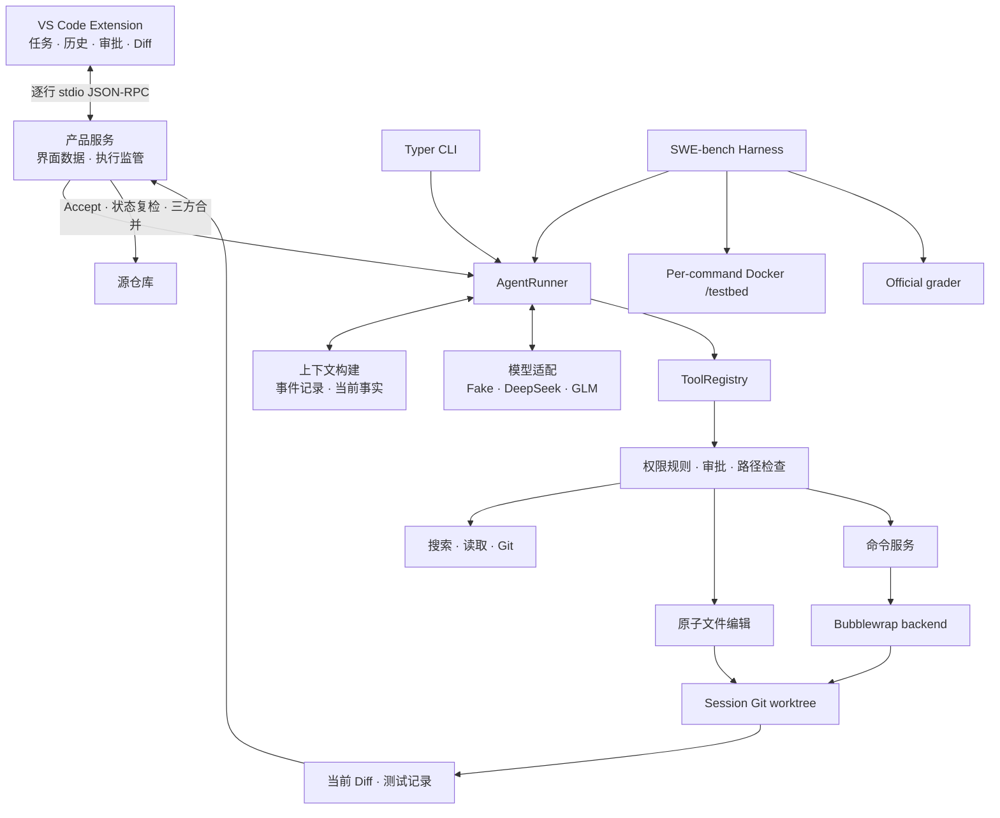

# 当前架构

本文描述 `0.5.0` 发布候选代码已经实现的系统。接口事实以源码和自动化测试为准。

上下文实现以[上下文管理与语义压缩技术设计](CONTEXT_MANAGEMENT_TECHNICAL_DESIGN.md)为架构基线：完整 Event Store
派生出 CCES、rolling semantic summary、连续 raw tail 和 Current Task Anchor，不再使用固定四步窗口或历史 residue。

## 阅读约定

本页需要使用少量内部名称。先给出它们的普通含义：

- **Session**：绑定一个源仓库的持久会话。
- **Candidate**：Agent worktree 中尚未交付的修改，中文称“待审查修改”。
- **baseline**：上一次已经接受的代码状态，用来计算下一份 Diff。
- **validation evidence**：某条测试命令对某一份代码成功执行的记录。
- **identity**：用于确认文件、仓库或运行配置仍是原来对象的一组客观值。
- **UserTurn**：一条真实用户请求。
- **ModelStep**：一次模型响应。
- **ToolExchange**：一次工具调用，以及对应的成功、失败或拒绝结果。
- **current / stale**：测试记录仍对应当前修改时为 current；代码变化后为 stale。

后文首次出现其他内部状态时，会在原地说明含义。

## 高层结构



本地产品和 benchmark 共用 AgentRunner、工具与待审查修改规则。

benchmark 只替换命令执行环境。它不替换宿主 Git worktree，也不经过 VS Code 的人工 Accept 流程。

## 模块职责

| 模块 | 当前职责 |
| --- | --- |
| `codeagent/session/` | Session metadata、append-only Event、全局索引与恢复 |
| `codeagent/context/` | 从事件重建模型上下文、加入当前运行事实并控制输入大小 |
| `codeagent/model_gateway/` | Fake、DeepSeek、GLM adapter 和 usage 标准化 |
| `codeagent/tools/` | 模型工具 schema、ToolRegistry、search/read/Git 工具 |
| `codeagent/runtime/` | Agent loop、Policy、Approval、原子编辑、命令、Candidate、validation |
| `codeagent/workspace/` | source/active identity 和 Git worktree 生命周期 |
| `codeagent/product/` | Product Application Service、Read Model、执行监管和 stdio RPC |
| `vscode-extension/` | 右侧栏 UI、SecretStorage、RPC client、原生 Diff document |
| `codeagent/benchmark/` | SWE-bench source、Docker executor、preflight、batch、grader 与报告事实 |

模型发起的工具调用通过 ToolRegistry，再进入对应 Policy 和服务。用户 Accept/Discard 走 Product Service，
benchmark 的环境准备和 grader 由 harness 调度；这些宿主操作不是模型工具，也不由 Bubblewrap 统一包围。

## 从用户请求到执行状态

一个 Session 保存模型配置、事件和工作区状态。一条用户请求可以包含多次模型调用。

每次模型调用又可能发起多个工具。持久化层用以下名称关联它们，产品 UI 不要求用户理解这些对象。

```text
Session
└── UserTurn：一条真实用户请求
    ├── ModelStep：一次 provider 响应
    └── ToolExchange：模型工具调用及其 terminal result/denial
```

Event 是一条持久化事件记录，同时保存 `turn_id` 和 `model_step_id`。

只有真实用户输入创建 UserTurn。内部执行切片的自动续跑不会新增用户消息。

每个切片默认最多 12 个 ModelStep。每个 UserTurn 默认总上限为 48。
总上限耗尽后，Runtime 等待用户明确扩额或 Stop。

## Agent Runtime 与上下文

`AgentRunner` 在每个 ModelStep 前从当前事实重新构建请求：

```text
events.jsonl
→ 显式 allowlist 的 CCES 与 closed manipulation atoms
→ valid rolling summary + 连续 raw event tail
→ 当前 Workspace、Candidate、validation、command environment snapshot
→ Current Task Anchor + transient recovery notice
→ fixed/history 双预算
→ provider request
```

Current Task Anchor 每次精确投影当前用户请求一次；其 source Event 仍可被 rolling summary 连续覆盖，但不会作为普通 raw
UserMessage 重复发送。Runtime 用 Git 和 Session metadata 更新 active workspace、changed paths、baseline、validation
和实际命令环境。预算由 Runtime 单独执行；后续内部切片通过临时控制消息告知模型已用步骤和当前上限，
并非 Runtime Snapshot 自带全部预算字段。

预算估算同时计算消息和工具 schema，并预留输出、续跑和安全余量。不可压缩 fixed 部分与 history 部分分开计量；
事件数或 token 达到软阈值时可调用一次 condenser，hard 超限时在同一主 ModelStep 前最多调用四次。Condenser 没有工具，
使用独立输入/输出预算，从最老的连续 closed atom 开始；一轮放不下时通过 predecessor summary 递归分块。每个有效 summary
写入 predecessor、增量 source IDs/digest、logical frontier 和 algorithm version，恢复时重新验证 chain。每次成功后必须
rebuild/re-estimate；仍不 fit 或无进展时 fail closed。Event Store 原记录不删除。

单条 ToolResult 文本仍限制为 16,000 字符。没有 Active Code、Working Set、RepoMap、RAG、文件重要度选择、typed residue、
completed-turn eviction 或 raw-to-zero fallback。

每个 provider 响应另写 `model_usage` Event，记录 `purpose=main_agent|context_condenser`、可获得的 token、provider request id、
`finish_reason` 和本次 `context_reductions`。Condenser usage 计入 Session/benchmark 总成本，但不归属主 ModelStep，也不消耗
UserTurn 步骤预算。usage 本身不进入后续模型上下文。

GLM 和 DeepSeek 启用 reasoning 后，会把 provider 返回的 `reasoning_content` 保存在对应的模型事件中。
它不会投影成普通 assistant 消息，也不会显示在产品界面。

同一 UserTurn 内，只把紧邻上一 ModelStep 的 `reasoning_content` 与该次 assistant tool call、terminal tool result
按 Provider 契约原样回传。这组 latest mandatory protocol 是最低上下文的一部分，planner 不跨越它，普通 raw renderer
也不会再生成一份相同 ToolCall/Result。更早 reasoning 不进入请求或 condenser；对应的可见 assistant/tool 历史仍按 CCES
保持 raw，直到被 semantic summary 连续吸收。原始 reasoning 始终保存在 Session 事件中。

输出因 `finish_reason=length` 截断且没有完整工具调用时，Runtime 保存部分 reasoning/content，并只在紧接着的恢复请求
中作为 assistant 历史原样回放，同时要求模型停止扩展探索、优先形成具体工具调用。恢复成功后该截断片段退出请求上下文；
连续截断只保留最新片段，三次后终止。缺失 `finish_reason` 时只有空响应且 usage 达到显式输出上限才使用 fallback。

DeepSeek V4 开启 reasoning 时不发送 `tool_choice`，让 Provider 使用有 tools 时的默认选择。对应的 assistant
tool-call 消息始终保留非 null `content`。GLM 继续发送普通 `tool_choice`，并使用 `clear_thinking: true`，让标准 API
清除其认定的 previous turns reasoning；当前工具交错所需的上一 ModelStep reasoning 仍由 Runtime 原样回传。
Runtime 的 UserTurn、ModelStep 和 execution slice 不是 Provider 文档中的同一种 turn，slice 边界不会触发 reasoning 清理。

## 工具与工作区升级

Session 从 `source_only` 开始。Search、Read 和只读 Git 工具针对 active workspace；第一次编辑或受控命令触发
workspace approval：

```text
source_only → preparing_workspace → changes_active
```

允许后，Runtime 检查源目录是 Git 根目录、有 HEAD 且没有 tracked 修改或 untracked 文件，
再创建 detached Git worktree 并重新构建工具服务。ignored 文件不随 Git worktree 自动复制。后续读取、编辑、命令和验证都针对该 worktree。
拒绝时 source 保持不变，本轮不会反复申请同一次 workspace upgrade。

`apply_workspace_edit` 是唯一通用编辑入口，支持受约束的 UTF-8 create/replace/delete/move。已有文件操作需要最近
读取的 SHA，整个 operations 数组先 prepare 后事务提交；无法证明回滚时进入 `recovery_required`。

## Command execution

`run_command` 接受 shell string，但宿主以 `shell=False` 启动固定的：

```text
/bin/bash --noprofile --norc -c <command>
```

每次调用都有新的 Bubblewrap 和 fresh shell。`EffectiveCommandEnvironment` 同时驱动真实进程环境、Runtime
Snapshot 和结果 provenance。Runtime 不解析 shell 语义、不自动修正命令、不自动安装依赖。

每条真实启动的命令都有 before/after Git audit。非零退出或 timeout 本身不会 taint；只有进程边界或执行后
workspace 状态无法确认时才进入 `workspace_tainted` 或 `recovery_required`。详细权限见[安全模型](SECURITY.md)。

## Candidate、validation 与 Accept

worktree HEAD 是最近 accepted baseline，working tree 是当前 pending changes。原子编辑和命令产生的文件变化都会
推进 `candidate_revision`。

`run_command(purpose="validation")` 以 Bash `pipefail` 执行，命令整体成功时记录执行证据；utility 命令不改变 shell
语义，也不形成验证证据。`current_validation_evidence` 查找状态为 passed、
workspace revision、base commit 与当前 subject tree 相同的记录，不以 `candidate_revision` 单独判定新鲜度。
文件树不同则旧证据 stale；恢复到同一树且其他身份相同，底层可再次使用旧成功证据。
Product Read Model 另以最近 validation 命令及其 candidate_revision 展示状态和控制按钮，口径并不完全相同；
UI 称其为 validation command success/current revision evidence，不把它描述为 official grader 通过。UI 可用性不能
代替 Accept 的实际树检查，official benchmark grader 也属于独立证据。Runtime 不判断测试选择是否充分。

Accept 时，Runtime 检查 worktree HEAD 与基线、当前 validation，临时冻结 patch 并记录修改序号和树身份，
再以 accepted baseline、Agent worktree、当前 source 做 Git 三方合并。非冲突的 source 并发修改可以保留；冲突
时拒绝覆盖并保留现场。成功后 worktree HEAD 前移为内部 checkpoint，用户 source branch 不会被自动 commit。
Discard 将 Candidate 恢复到 accepted baseline，并清理 worktree 中未跟踪和 ignored 文件，不修改 source。

Accept 成功时，Session 会保存该次应用的 patch、文件列表和可预览的前后文本。Product Service 从这份只读快照
重建 Applied Diff，不读取 source 的后续工作区变化。每个文本快照仍受 512 KB 预览上限约束。

Diff 展示的是 baseline 到当前 Agent 文件，Accept 时才计算与 source 的合并结果。冻结后的 source tree 会在应用前
再次比较，patch 进行 hash 与 apply-check 检查，应用后复核 merged tree。但 RPC 不携带“用户看过的 Diff 指纹”，
也没有跨进程文件锁；不应宣称能杜绝所有外部并发写入竞态。成功 validation 验证的是 Agent 文件树，
不会自动重跑用户并发修改合入后的结果。

## Product 与 Event timeline

Extension 只通过 `codeagent-rpc` 读取 Product Read Model，不直接读取 Session 文件或 worktree。Product Service
提供 Session、执行、Approval 和 Changes 操作；Execution Supervisor 保证一个 Session 同时只有一个 active job。

执行过程通过 `session/event`、`approval/requested` 和 `session/executionStateChanged` notification 更新 UI。完整
Event 保存在 `events.jsonl`，UI 只投影有界摘要。Approval bridge 只存在于当前 Runtime 进程和 job；Runtime
重启后不会恢复待处理审批；已经持久化的 session-scope grant 与待处理 Approval 不同，仍按 Policy 复检。

`context_condensed` 在 timeline 中投影为紧凑的 Runtime/System 项，详细信息可展开；它不冒充 assistant message 或
reasoning。成功且无需用户处理的 condensation attempt 默认隐藏。多次 `model_output_truncated` 在同一 UserTurn 内合并为
自动恢复提示，只有最终 `output_truncated` 或 `context_budget_exceeded` 才显示终止告警。Current Task Anchor 只属于模型
Context View，不是持久 Event，因此不会在产品时间线重复用户消息。

## 持久化与恢复

正常业务状态的权威来源是：

```text
session.json   Session、workspace、revision 和非 secret 配置
events.jsonl   对话、工具 terminal 结果、审批、usage 和控制事件
Git worktree   accepted baseline 与当前 Candidate 文件
deliveries/    Accept 后用于回看 Diff 的只读交付快照
```

成功命令的完整 stdout/stderr、Runtime HOME/TMP、事务备份和临时 frozen patch 不作为长期权威状态。
失败、timeout、tainted 或 recovery 场景可以保留有界 diagnostics。已应用交付物单独保留用于审查，
不能重新应用或执行一键撤销。Resume 从 metadata、Event、Git 状态和交付快照重建服务，
不恢复崩溃前正在执行的 Python、shell 或 provider 调用。

## SWE-bench backend

SWE-bench source preparer 从固定 digest 的官方 instance image 导出 prepared `/testbed`，验证 base commit、HEAD 和
tree 后建立宿主 Candidate worktree。每条 Agent 命令创建一次性 Docker container，把同一 Candidate bind mount
到 `/testbed`；文件变化回到宿主 worktree。完成后导出 patch，交给 official grader 判定 resolved。

Gold patch、FAIL_TO_PASS 和 PASS_TO_PASS 不被 harness 注入 Agent prompt 或 ToolRegistry；它们用于 preflight/grader。
这是评测数据流隔离，不是面对 Docker daemon 或宿主管理员的独立防泄漏边界。完整口径
见 [Benchmark 说明](BENCHMARKING.md)。

## 当前限制

- 仅支持 Linux/WSL2 本地运行和满足准入约束的 Git repository；
- 本地执行没有 cgroup CPU/内存/进程数限制、复杂 seccomp 或 domain/port 网络 ACL；
- 编辑不支持二进制、编码猜测、任意 mode/copy、递归目录操作和 case-only rename；
- Runtime 不判断 validation 质量、不自动解决 merge conflict；
- Accept 后可以回看 Applied Diff，但不提供 one-click Undo；
- SWE-bench Docker executor 不是通用产品 workspace backend；
- 当前没有多 Agent、长期语义记忆或通用环境自动准备。
