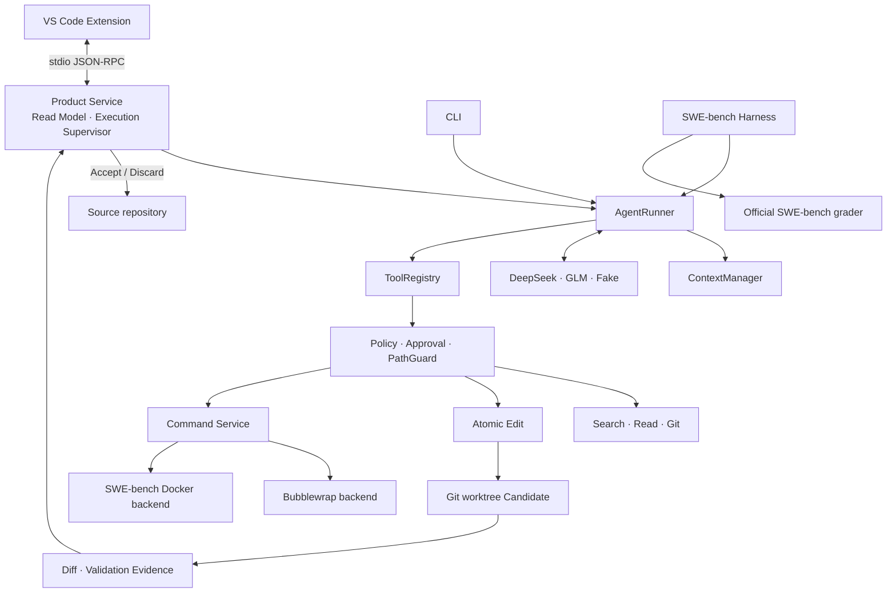

# 当前架构

本文描述 CodeAgent `0.5.0` 当前已经实现的系统。它面向需要理解 Runtime 数据流、状态边界和模块职责的开发者；
接口细节分别见[上下文参考](CONTEXT.md)、[命令环境](COMMAND_ENVIRONMENT_CONTRACT.md)、
[Product RPC](RPC.md)和[评测方法](BENCHMARKING.md)。源码与自动化测试是最终事实源。

## 核心对象

- **Session**：绑定一个源仓库的持久会话。
- **UserTurn**：一条真实用户请求；内部续跑不会创建新的 UserTurn。
- **ModelStep**：一次主模型响应。
- **ToolExchange**：工具调用及其成功、失败或拒绝结果。
- **Candidate**：Agent worktree 中尚未交付的修改。
- **baseline**：最近一次已接受的代码状态。
- **validation evidence**：某条 validation 命令对特定 Candidate 文件树成功执行的记录。

## 系统结构



本地产品和 benchmark 共用 `AgentRunner`、Context、ToolRegistry、Candidate 与 validation 语义。
二者的主要区别是命令 backend 和交付方式：产品使用 Bubblewrap 并由用户 Accept；benchmark 在一次性 Docker
container 中运行项目命令，直接导出 patch 给 official grader。

## 模块职责

| 模块 | 职责 |
| --- | --- |
| `codeagent/session/` | Session metadata、append-only Event、索引和恢复 |
| `codeagent/context/` | 从 Event 派生模型 Context、当前事实和输入预算 |
| `codeagent/model_gateway/` | Provider 请求、tool protocol、reasoning 和 usage 标准化 |
| `codeagent/tools/` | 工具 schema、ToolRegistry、搜索、读取、Git、编辑和命令入口 |
| `codeagent/runtime/` | Agent loop、Policy、Approval、命令、原子编辑、Candidate 与 validation |
| `codeagent/workspace/` | source/active identity 和 Git worktree 生命周期 |
| `codeagent/product/` | Product Service、Read Model、执行监管和 stdio RPC |
| `vscode-extension/` | 会话 UI、SecretStorage、审批和原生 Diff |
| `codeagent/benchmark/` | SWE-bench 准备、Docker executor、batch、grader、恢复和报告 |

所有模型工具调用都先经过 ToolRegistry，再进入 Policy 和对应服务。Product 的 Accept/Discard、benchmark 环境准备
和 official grader 是宿主控制操作，不是模型工具。

## Runtime 主链路

```text
UserTurn
→ append user_message Event
→ ContextManager 从持久事件和当前 Runtime 状态构建请求
→ main model 返回最终消息或 ToolCall
→ ToolRegistry、Policy 和 Approval 检查
→ read / edit / command 服务执行
→ terminal ToolResult 写入 Event Store
→ Candidate 与 validation 状态重新计算
→ 下一个 ModelStep
→ assistant_message 或 turn_terminated 关闭 UserTurn
```

一次 UserTurn 默认总上限为 48 个 ModelStep；单个执行切片默认 12 个。产品 supervisor 和 benchmark harness
会在同一个后台任务中自动跨切片继续，切片边界不会重复用户消息。总预算耗尽后，产品等待用户明确扩额或停止；
固定预算 benchmark 将该题结束为 budget exhausted。

## Session 与 Event

`events.jsonl` 是 append-only 运行记录。Event 使用 `turn_id` 和 `model_step_id` 关联 UserTurn、ModelStep 和
ToolExchange；`session.json` 保存 workspace、revision、provider 和非 secret 配置。模型回复、工具 terminal result、
审批、validation、usage、上下文压缩和恢复状态都以 Event 记录。

Event Store 是审计历史，不等同于下一次模型输入。Context、Product timeline、validation summary 和 benchmark
trajectory 都是由 Event 与当前 Git/metadata 状态派生的不同 Read Model。派生视图可以有界化展示，但不能删除或改写
原始 Event。

每次 provider 响应写入 `model_usage`，其中 `purpose` 区分 `main_agent` 和 `context_condenser`。
Condenser usage 计入 Session 与 benchmark 成本，但不占用 UserTurn 的主 ModelStep 预算。

## Context 构造

每个主 ModelStep 前都重新构建请求：

```text
System instructions 和 tools
+ 当前 Runtime Snapshot
+ 已验证的 rolling semantic summary（若存在）
+ 未被摘要覆盖的连续近期 CCES raw tail
+ 当前 UserTurn 的 Current Task Anchor
+ 最近一次必须连续回传的 provider tool protocol
+ 必要的临时续跑或恢复控制消息
```

Runtime Snapshot 由当前 workspace、Git、Candidate、validation 和 command environment 重新读取，是当前状态的
权威来源。原始历史 Event 是发生过的事实；semantic summary 是有损历史记忆，不能覆盖 Snapshot、授予权限或构造新的
用户要求。

CCES 只允许真实用户消息、assistant tool call、terminal tool result/denial、assistant final 和 turn termination。
它按不可拆分的 closed atom 维护工具协议。Current Task Anchor 保证当前用户请求在每个主请求中精确出现一次。

当历史事件数或估算 token 达到软阈值，Runtime 可以压缩最老的连续 closed prefix；达到 hard 输入边界时必须先压缩。
有效摘要形成带 predecessor 和 source coverage 的 rolling chain，近期未覆盖历史保持为连续 raw tail。成功后必须重新构建
并估算主请求；仍不能安全容纳、摘要无效或有界重试耗尽时 fail closed，不会静默删除必需上下文。

单条 ToolResult 的模型可见文本最多 16,000 UTF-8 字节。完整 Context 顺序、预算、chain 校验和 Event contract 见
[上下文参考](CONTEXT.md)。

## Reasoning 与输出截断

启用 reasoning 时，GLM 和 DeepSeek 的 `reasoning_content` 保存在对应模型 Event 中，但不会显示成产品消息，也不会进入
semantic condenser。正常工具循环只在紧邻下一 ModelStep 原样回传上一 ModelStep 的 reasoning、assistant tool call 和
terminal tool result；更早 reasoning 不进入 provider Context，原始 Event 仍保留。

Provider 明确返回 `finish_reason=length` 且没有完整工具调用时，Runtime 保存本次 partial reasoning/content，并只在紧邻
恢复请求回放，同时要求模型停止扩展探索并形成具体工具调用或最终回答。GLM‑5.3 和 DeepSeek 的恢复请求临时使用 `low`
reasoning effort；恢复成功后，后续请求回到 Session 配置的档位。连续三次截断仍未完成时，Runtime 有界终止并保留 Session
和 Candidate。该策略降低恢复开销，但不保证模型永不截断。

GLM 使用 `clear_thinking=true` 调用标准 API；Runtime 仍显式提供当前工具交错所需的最近协议。DeepSeek reasoning 模式
不发送 `tool_choice`，让 Provider 使用带 tools 请求的默认选择。

## Workspace、工具与 Candidate

Session 从 `source_only` 开始。搜索、读取和只读 Git 针对 active workspace；第一次编辑或运行受保护命令时，产品请求
创建隔离 worktree：

```text
source_only → preparing_workspace → changes_active
```

升级前要求源目录是有 HEAD 的干净 Git 根目录。获批后创建 detached worktree，后续读写、命令和 validation 都针对它；
source 保持只读。拒绝不会产生隐式授权或反复弹出同一升级请求。

`apply_workspace_edit` 是通用编辑入口，支持受约束的 UTF‑8 create、replace、delete 和 move。修改已有文件需要最近读取的
SHA；整个 operations 数组先 prepare 再事务提交。无法证明事务或命令边界安全时，Session 进入 `recovery_required` 或
`workspace_tainted`，Accept 保持关闭。

worktree HEAD 是 accepted baseline，working tree 是 Candidate。原子编辑和命令产生的文件变化推进
`candidate_revision`；Git subject tree 和 base commit 用于判断实际文件身份。

## Command 与 sandbox

Product Runtime 的每次 `run_command` 都创建新的 Bubblewrap 和 fresh Bash：

```text
/bin/bash --noprofile --norc -c <command>
```

命令默认断网；Candidate 和 Runtime 私有目录可写，source 与相关 Git metadata 只读。额外网络或文件写入经过 Policy 与
Approval。Bubblewrap 不可用时 fail closed，不回退到宿主 shell。命令环境、process environment 和返回 provenance 来自同一
`EffectiveCommandEnvironment`。详细边界见[命令环境](COMMAND_ENVIRONMENT_CONTRACT.md)和[安全模型](SECURITY.md)。

SWE-bench 使用不同 backend：每条项目命令创建一次性 Docker container，并把同一宿主 Candidate bind mount 到
`/testbed`。Docker 只替换命令环境，不承载 Agent loop、文件工具或 Product Approval。

## Validation、Diff 与交付

`run_command(purpose="validation")` 使用：

```text
/bin/bash --noprofile --norc -o pipefail -c <command>
```

只有 validation purpose、命令成功退出且 workspace audit 完整时才形成 validation evidence。普通 `utility` 命令保持常规
Bash pipeline 语义，不会被 Runtime 自动提升为 validation。命令退出成功只证明该命令完成；validation evidence 还要绑定
Candidate 文件树；official SWE-bench grader 是第三类独立结果。这三者不能混称为“测试通过”。

Accept 前重新核对 worktree HEAD、baseline、Candidate tree 和 current validation。Runtime 冻结 patch 后，以 accepted
baseline、Agent worktree 和当前 source 做 Git 三方合并：不冲突的用户并发修改可保留，冲突则停止并保留现场。Accept
不会提交用户分支。Discard 将 Candidate 恢复到 baseline，并清理其未跟踪和 ignored 文件，不修改 source。

Pending Diff 来自 baseline 与 Agent worktree。Accept 后，Session 保存本次 patch、文件列表和有界 before/after 文本快照，
用于回看 Applied Diff；它不读取用户之后继续修改的 source。当前不提供 one-click Undo。

## Product 与 timeline

Extension 只通过 `codeagent-rpc` 使用 Product Read Model，不直接读取 Session 文件或 worktree。Execution Supervisor 保证
一个 Session 同时只有一个 active job。`session/event`、`approval/requested` 和
`session/executionStateChanged` notification 只是刷新提示，界面随后重新读取权威状态。

完整 Event 留在 `events.jsonl`，timeline 只显示面向用户的投影。语义压缩和成功的截断恢复各显示一行低干扰 Runtime
提示，不展示摘要正文、reasoning、token、模型或恢复 JSON；最终无法恢复时才显示终止告警。

## 持久化与恢复

```text
session.json   Session、workspace、revision 和非 secret 配置
events.jsonl   对话、工具、审批、usage、validation 和控制事件
Git worktree   accepted baseline 与当前 Candidate
deliveries/    Accept 后用于回看 Diff 的只读交付快照
```

重启后从这些持久对象重建服务。正在执行的 provider 请求、shell 进程和未处理审批不能从中点恢复；未处理审批不会变成授权。
成功命令的完整临时输出、Runtime HOME/TMP 和事务备份不属于长期权威状态。

## SWE-bench 数据边界

Harness 从固定 digest 的官方 instance image 导出 `/testbed`，验证 base commit、HEAD 和 tree，再创建宿主 Candidate。
完成后导出 patch 并交给 official grader。Gold patch、FAIL_TO_PASS 和 PASS_TO_PASS 不进入 Agent prompt 或 ToolRegistry；
它们只用于环境准备和评分。这是评测数据流隔离，不是抵御 Docker daemon 或宿主管理员的安全边界。

## 当前限制

- 仅支持 Linux/WSL2 和满足准入条件的本地 Git repository；
- 本地 sandbox 没有 cgroup CPU/内存/进程数限制、复杂 seccomp 或 domain/port 网络 ACL；
- 编辑不支持二进制、编码猜测、任意 mode/copy、递归目录操作和 case-only rename；
- Runtime 不判断 validation 是否充分，也不自动解决 merge conflict；
- Applied Diff 可回看，但没有一键撤销；
- SWE-bench Docker executor 不是通用 Product workspace backend；
- 当前没有多 Agent、RepoMap、RAG、Working Set 或长期语义记忆。
