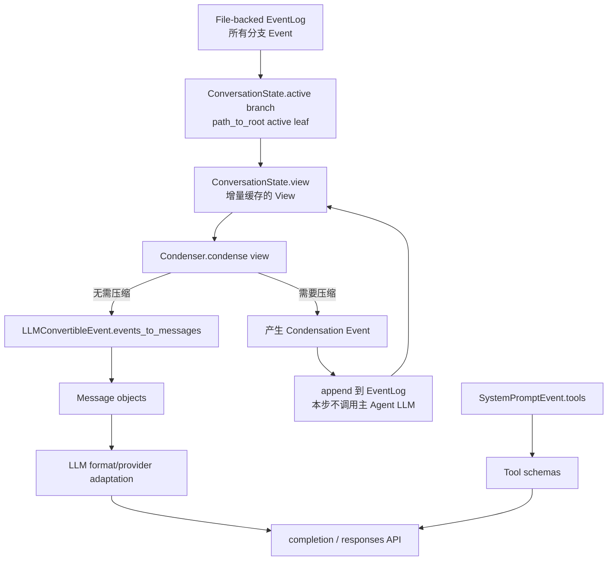
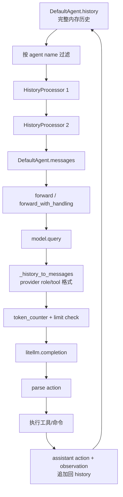
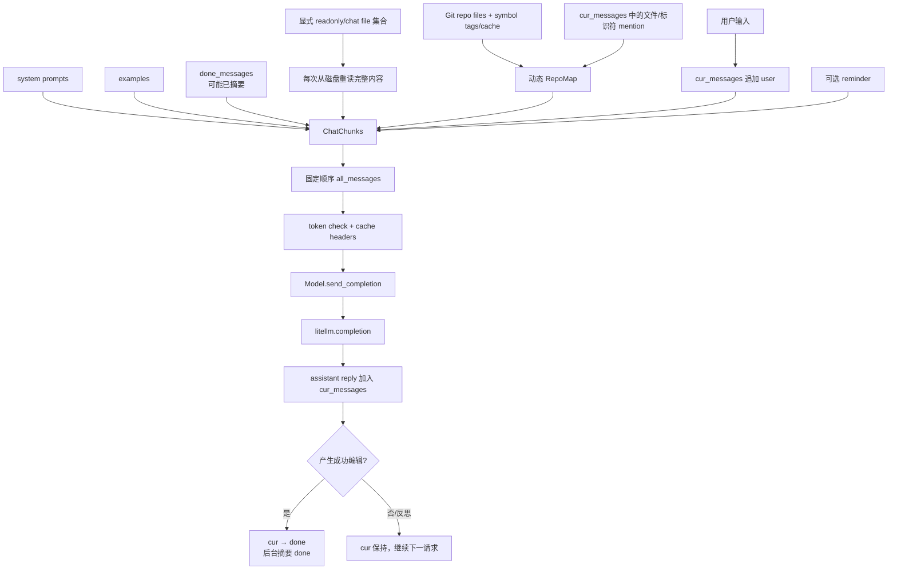

# Coding Agent Context 实现源码调研

状态：2026-08-31 源码调研结论
目的：弄清成熟开源 Coding Agent 在每次模型 API 调用前如何组织 Context，以及各类数据的来源、更新、压缩、持久化和失效生命周期，为 CodeAgent Context Management v2 提供实现依据。

> 后续产品取舍：D-2026-08-31-01 决定 v2 暂不建设隐式 Working Set。本文的源码事实保持有效；原先由调研直接推导 WorkingSet 的建议已按该决策修正。

## 1. 调研范围与版本

本次直接读取以下浅克隆源码，不以宣传文档代替代码事实：

| 项目 | Commit | 重点 |
| --- | --- | --- |
| OpenHands Software Agent SDK | `704cbe6015e3d59cabe04632175d99df2d448999` | append-only Event、View、Condensation、tool protocol 原子边界、API renderer |
| SWE-agent | `3ea751c087f32b16e039a2233dd6eefecef325d5` | history、HistoryProcessor、observation 生命周期、LiteLLM 请求 |
| Aider | `5dc9490bb35f9729ef2c95d00a19ccd30c26339c` | ChatChunks、显式 chat files、RepoMap、done/current history、异步摘要 |

源码保存在 `reference/`，具体路径见 `reference/README.md`。三个项目解决的问题和产品交互不同，不能把它们抽象成同一种 processor 架构后直接复制。

## 2. 先给出结论

三个项目真正共同的做法只有一条：**权威历史与单次 API 输入不是同一个对象**。

它们的具体实现差异很大：

| 项目 | 长期/权威历史 | 单次调用视图 | 代码上下文来源 | 压缩是否写入持久历史 |
| --- | --- | --- | --- | --- |
| OpenHands | file-backed append-only EventLog | active branch 的缓存 `View` | system context 和工具 Observation | 是；追加 `Condensation` tombstone Event，原 Event 不删除 |
| SWE-agent | 内存 `history`，随 trajectory JSON 保存 | `history_processors` 顺序改写后的 messages | observation 模板及 windowed tools 状态 | 否；processors 通常只构造 API 视图，没有正式 condensation Event |
| Aider | `done_messages`、`cur_messages`，另有 chat/LLM 日志 | 固定顺序的 `ChatChunks` | 每次重读显式 chat files + 动态 RepoMap | 摘要替换内存中的 `done_messages`；原始日志是另一条记录链 |

对 CodeAgent 最重要的发现：

1. OpenHands 最值得借鉴的是 append-only Event 与可重建 View 的语义，以及只能在合法 tool loop 边界压缩；它没有替 CodeAgent 解决稳定源码 Working Set。
2. SWE-agent 的调用前 processor 很简单、可组合，但 `ClosedWindowHistoryProcessor` 对同一文件只保留最新窗口，正是 CodeAgent HTTPX 失败中需要避免的退化。
3. Aider 的代码理解稳定性主要来自“显式加入 chat 的文件每次从磁盘完整重读”，而不是来自 chat summary；RepoMap 只为未加入 chat 的文件提供有限结构视图。
4. CodeAgent v2 不应简单选择其中一个项目照搬。首个基线采用 OpenHands 的 Event/View/合法边界和 SWE-agent 式小型确定性投影；Aider 证明稳定文件集需要明确 add/drop 生命周期，因此不从 Agent read 行为隐式推断同类 Working Set。

## 3. OpenHands：EventLog → View → Condensation → Messages

### 3.1 每次 API 调用的数据流



真实主调用链：

```text
Agent.step()/astep()
→ state.view
→ prepare_llm_messages()/aprepare_llm_messages()
→ condenser.condense()/acondense()
→ LLMConvertibleEvent.events_to_messages()
→ make_llm_completion()/amake_llm_completion()
→ LLM.completion() 或 LLM.responses()
→ provider/LiteLLM transport
```

关键源码：

- `openhands-sdk/openhands/sdk/agent/agent.py`：`Agent.step`、`Agent.astep`；
- `openhands-sdk/openhands/sdk/agent/utils.py`：`prepare_llm_messages`、`make_llm_completion`；
- `openhands-sdk/openhands/sdk/context/view/view.py`：`View`；
- `openhands-sdk/openhands/sdk/event/base.py`：`events_to_messages`；
- `openhands-sdk/openhands/sdk/llm/llm.py`：provider 格式化和实际 transport。

### 3.2 Event 与 View 的生命周期

`ConversationState.append_event()` 是 Event 写入的单一入口：为 Event 标记 `parent_id`、追加到 file-backed `EventLog`、推进 active leaf。Event 是 frozen Pydantic object，追加后不修改。

`ConversationState.view` 是 active branch 的派生缓存：

- 线性追加时，只把新 tail Event 依次送入 `View.append_event()`，成本为 O(k)；
- fork、navigate、cold resume 或缓存异常时，从 active leaf 的 `path_to_root()` 完整重建；
- abandoned branch 不进入当前 View，但仍保留在 EventLog；
- View 不是新的权威存储，可从 EventLog 重建。

`View.append_event()` 根据 Event 类型投影：

- `LLMConvertibleEvent`：加入 View；
- `Condensation`：应用 tombstone 语义，移除指定 Event ID，并按 offset 插入动态 summary Event；
- `CondensationRequest`：只设置未处理请求标志；
- 内部状态 Event：不进入 LLM View。

因此 OpenHands 没有删除旧 Event。压缩后的模型视图是：

```text
原始 EventLog
+ 后续 Condensation(forgotten_event_ids, summary, summary_offset)
→ 可重复计算的精简 View
```

### 3.3 System、工具和动态 Context

初始化时 `Agent.init_state()` 追加一个 `SystemPromptEvent`，其中包含：

- static system prompt；
- conversation-scoped dynamic context；
- 当时可用的 `ToolDefinition` 列表。

它本身是 EventLog 中的 `LLMConvertibleEvent`。每次构建消息时转换成 system message；工具定义同时用于 token 计数，并在 `make_llm_completion()` 中作为独立 `tools` 参数传入 API。

dynamic context 包括 repository skills、runtime 信息、secret 描述等。它在初始化阶段被物化进 `SystemPromptEvent`，不是每次 API 调用都从 workspace 自动重新推导。某些内存/技能数据会在 conversation 启动时从磁盘解析，但其生命周期与工具产生的代码 Observation 不相同。

### 3.4 Condensation 的真实机制

默认 `LLMSummarizingCondenser` 是 rolling condenser：

- 默认最多 80 个 View Event；
- 默认保留开头 4 个 Event；
- event count 超限是 soft trigger；
- token limit 或显式 request 是 hard trigger；
- token 压缩目标不是“刚好低于上限”，而是降到有效上限的一半附近；
- 保留头部和最近 suffix，中间旧 Event 由独立 summarizer LLM 总结；
- summary 自己在以后也可以再次被总结。

其 summarizer prompt 不是自由摘要，而是要求优先保留 `USER_CONTEXT`、任务状态、代码路径/签名、测试、修改、依赖和版本控制状态。不过这些仍是模型生成的派生陈述，OpenHands 通过保留原始 Event 和 summary 对应的 forgotten Event IDs 保持可审计性，而不是把摘要升级为环境真相。

如果需要压缩，condenser 返回 `Condensation` 而不是 messages。Agent 将它写入 EventLog并结束本 step；下一 step 的 View 才应用这次压缩并调用主 Agent LLM。这使 condensation 成为可观察、可恢复的状态转换，而不是一次 API 调用内部的隐式 mutation。

### 3.5 为什么不能按任意 token 边界裁剪

`View.manipulation_indices` 对多个属性求交集，只有共同合法的位置才能切分。至少包括：

- action 与 observation 必须一一配对；
- batch action 的原子性；
- 带 thinking block 的连续 tool loop 原子性；
- observation 唯一性。

`LLMSummarizingCondenser._get_forgotten_events()` 先计算理想裁剪位置，再移动到合法 manipulation index。这一点比 CodeAgent 当前“按完整 UserTurn 淘汰”更细，也比直接删除旧 tool result 更安全。

### 3.6 OpenHands 没有解决什么

OpenHands SDK 的核心 View 仍主要是 Event history view。文件内容通常来自工具 Observation，并没有在这条主链上看到类似 Aider `chat_files` 的独立稳定 Working Set：

- 旧文件 Observation 可能被 condensation 总结；
- summary 是否保留足够代码语义依赖 summarizer；
- Agent 仍可能重新调用工具读取文件；
- Context Condenser 主要解决历史容量和协议合法性，不等价于代码工作集管理。

所以 OpenHands 的实现可以解决 CodeAgent 的 active UserTurn 压缩和可恢复性问题，却不能单独修复 HTTPX 中“后读小范围覆盖先前完整源码”的问题。

## 4. SWE-agent：History → Processors → LiteLLM

### 4.1 每次 API 调用的数据流



真实调用链：

```text
DefaultAgent.step()
→ self.messages property
→ history_processors 顺序调用
→ forward_with_handling(messages)
→ forward(messages)
→ model.query(history)
→ LiteLLMModel._history_to_messages()
→ LiteLLMModel._single_query()
→ litellm.completion()
```

关键源码：

- `sweagent/agent/agents.py`：history、messages、step、observation append；
- `sweagent/agent/history_processors.py`：所有内置 processor；
- `sweagent/agent/models.py`：provider messages、token check、LiteLLM 调用；
- `config/default.yaml` 与 `config/sweagent_0_7/*.yaml`：实际 processor 配置。

### 4.2 History 的来源和生命周期

setup 阶段按顺序把以下内容加入 `history`：

1. system template；
2. 可选 demonstrations；
3. instance template，其中包含 problem statement 和工具提供的初始 state。

每一步完成后追加两部分：

1. assistant action：模型文本、thought、action、tool calls、thinking blocks；
2. observation：命令输出以及工具 state 经模板渲染后的 user/tool message。

`history` 是 Agent 内存中的完整列表；`get_trajectory_data()` 将完整 history、trajectory 和 info 写入 `.traj` JSON。模型调用使用的是 processor 生成的 `messages`，但 `StepOutput.query` 也会保存本次实际 query，用于轨迹审计。

这套持久化更偏 benchmark trajectory，不像 CodeAgent/OpenHands 那样把 append-only Event 作为恢复状态机的正式权威源。

### 4.3 Processors 实际做了什么

内置 processor 都是确定性 history transformation，没有通用 LLM summary：

- `LastNObservations`：保留最近 N 个 observation 正文；旧 observation 替换为“省略 N 行”的占位文本，但 action 仍保留；
- `TagToolCallObservations`：按函数名给 action/observation 加 keep/remove tag；
- `ClosedWindowHistoryProcessor`：从后向前扫描文件窗口，同一文件只有最新窗口保留正文，旧窗口改为 outdated placeholder；
- `RemoveRegex`：从旧消息中删除 diff 等大块文本；
- `CacheControlHistoryProcessor`：把 provider cache marker 放到最近几个 user/tool message；
- `ImageParsingHistoryProcessor`：把 data URI 转为 multimodal content。

默认现代配置只启用 cache control；旧 `sweagent_0_7` 配置常用 `LastNObservations(n=5)`。也就是说 SWE-agent 并没有依赖一套复杂通用 compactor 才工作，它更多依赖工具、模板和有限 observation 窗口形成紧凑轨迹。

### 4.4 代码上下文来自哪里

SWE-agent 的源码上下文通常由 windowed/search/edit 工具返回，并作为下一条 observation 写入 history。工具 state 会作为模板变量传给 `next_step_template`；是否真正渲染哪些 state 字段由具体配置决定，默认模板主要包含 observation。

`ClosedWindowHistoryProcessor` 试图避免重复文件窗口膨胀，但其规则是“每个文件只保留最新窗口”。这和 CodeAgent v1 的 `evidence[path] = latest_range` 语义接近：

```text
先看到 file.py 1–242
后看到 file.py 1–60
→旧 1–242 被标记 outdated
→当前醒目视野只剩 1–60
```

因此它不是 HTTPX 问题的现成答案。它更适合严格 windowed tool：工具自己维护当前位置，并假设最新窗口就是下一步编辑所需窗口。CodeAgent 的 `read_file` 是自由范围读取，不能继承这个假设。

### 4.5 Context 超限与失效

`LiteLLMModel._single_query()` 在调用前使用 tokenizer 计算 messages；超过 `model_max_input_tokens` 直接抛 `ContextWindowExceededError`。默认 Agent 的错误处理倾向于 autosubmit/退出，没有 OpenHands 那种在同一执行链上自动追加 condensation Event 后继续的正式恢复协议。

Processor 的结果通常是调用时派生值；但部分 processor 对浅拷贝 entry 或原 entry 设置 tag/cache control，代码层面并非全部严格纯函数。借鉴其组合模式时，不应照搬这种可变对象边界。

## 5. Aider：固定 ChatChunks + 显式文件重读 + RepoMap

### 5.1 每次 API 调用的数据流



`ChatChunks.all_messages()` 的真实固定顺序是：

```text
system
→ examples
→ readonly_files
→ repo
→ done
→ chat_files
→ cur
→ reminder
```

注意代码中的 dataclass 字段顺序与 `all_messages()` 顺序不完全相同，应以方法为准。

真实调用链：

```text
Coder.send_message(inp)
→ cur_messages.append(user)
→ format_messages()
→ format_chat_chunks()
→ ChatChunks.all_messages()
→ check_tokens()
→ Coder.send()
→ Model.send_completion()
→ litellm.completion()
```

关键源码：

- `aider/coders/base_coder.py`：所有 chunk 的来源、send_message、done/current 生命周期；
- `aider/coders/chat_chunks.py`：chunk 顺序和 cache marker；
- `aider/history.py`：ChatSummary；
- `aider/repomap.py`：RepoMap 排序、预算和缓存；
- `aider/models.py`：实际 provider 请求。

### 5.2 `done_messages` 与 `cur_messages`

Aider 显式区分：

- `cur_messages`：当前编辑/反思链，包含本轮 user、assistant、lint/test反馈等；
- `done_messages`：此前已经完成的对话历史。

模型成功产生并应用编辑后，`move_back_cur_messages()` 把 current 整体移动到 done，并异步启动摘要。若正在修复 lint/test、模型要求加入文件或发生 reflected message，current 会继续保留，下一次 API 调用仍携带完整近期链。

摘要只针对 `done_messages`：

- 超过 `max_chat_history_tokens` 才启动；
- 保留约一半预算的最近 tail；
- head 由 weak model 优先总结，失败再尝试 main model；
- 若 summary + tail 仍超限，最多递归压缩；
- 摘要线程结束后，只有原 `done_messages` 未变化才原子替换，避免并发覆盖新历史；
- 确保摘要结果以 assistant message 结束，以维持消息角色结构。

Aider 的摘要 prompt 特别要求保留函数名、库、包和 fenced code 中出现的文件名，但要求删除代码块本身。`summarize_all()` 只把 USER/ASSISTANT 内容送入摘要模型；这适合 Aider 自身的消息结构，不应原样用于包含正式 tool role/result 的 CodeAgent。

这是一种简单有效的“已完成历史可压缩、当前执行链保真”策略。它没有处理 append-only Event 追溯，Aider 通过独立 chat history/LLM history 日志保存更完整记录。

### 5.3 Chat files 是稳定 Working Set

`abs_fnames` 和 `abs_read_only_fnames` 是显式文件集合。每次 `format_chat_chunks()` 都调用：

- `get_read_only_files_content()`；
- `get_chat_files_messages()`；
- `get_files_content()` / `get_abs_fnames_content()`。

这些方法从当前磁盘重新读取完整文件正文。文件删除或不可读时会从 chat 集合移除。因此：

- 代码正文不依附旧 read observation；
- 后续一次局部查看不会缩小已加入 chat 的文件；
- 编辑后下次请求自然看到最新内容；
- 生命周期由显式 add/drop file 控制；
- 代价是大文件/多文件会直接消耗大量 token，需要用户或 Agent控制集合。

这是三者中对 CodeAgent HTTPX 问题最直接的实现参考。

### 5.4 RepoMap 的来源和生命周期

RepoMap 面向未完整加入 chat 的其他 Git 文件：

1. 从 repository file list 获取 chat files 与 other files；
2. 从 `cur_messages` 提取文件名和 identifier mention；
3. 用 tree-sitter/pygments 获取 definition/reference tags；
4. 构建文件引用图并使用 PageRank 类排序；
5. 对提到的文件、标识符和重要文件提高权重；
6. 二分选择能落入 `max_map_tokens` 的 tag/tree 前缀；
7. 按 refresh 策略和 cache key 复用结果。

RepoMap 每次可能根据 current message mention 改变，但它不是完整源码。Aider 把“全局结构认知”和“当前编辑文件正文”拆成两个不同 chunk，避免用一种 retrieval 表示承担全部代码理解。

### 5.5 Aider 没有解决什么

- 它依赖显式 chat file 集合，文件提升和淘汰经常由用户交互控制；
- 全文件重读在大文件和跨多文件任务中成本高；
- 摘要不具备 OpenHands 的 Event tombstone 和 provider tool loop合法边界，因为 Aider 的主要交互协议不同；
- 它不是通用 ReAct tool history，因此不能直接复制 `ChatChunks` 消息形状到 CodeAgent。

## 6. 三个项目的数据生命周期对照

| 数据 | OpenHands | SWE-agent | Aider |
| --- | --- | --- | --- |
| 用户请求 | Message Event，持久 | history item，trajectory 保存 | cur message，另有 chat log |
| 模型动作 | Action/Message Event，持久 | action history + trajectory | cur message/LLM log |
| 工具结果 | Observation Event，持久 | observation history |通常进入反思/命令反馈，不是统一 Event 模型 |
| System prompt | 初始化时持久为 SystemPromptEvent | setup 时加入 history | 每次由 prompt config 重建 |
| 工具 schema | SystemPromptEvent 保存定义；调用时另传 | ToolConfig 持有；调用时另传 | coder functions；调用时另传 |
| 当前文件正文 | 主要来自 Observation | 主要来自 window observation/state | 显式文件集合，每次重读磁盘 |
| Repo 概览 | agent context/skills，不等价于 RepoMap |可由 filemap 工具提供 | RepoMap 独立 chunk |
| 历史压缩 | Condensation Event +派生 View | 调用前 processor elide | done history 被 LLM summary 替换 |
| 最近执行链 | View suffix 保留 |最近 N observation 保留 | cur_messages 完整保留 |
| Provider 合法性 | View properties 显式维护 |主要依赖 processor/config 不破坏配对 |交互形态不同，Model 层修正角色 |
| Resume | EventLog + State 正式恢复 | trajectory 更偏记录/回放 |可恢复 chat history，代码来自工作树 |

## 7. 对 CodeAgent v1 的具体诊断

CodeAgent 当前链路是：

```text
events.jsonl
→ project_events()
→ RuntimeSnapshot
→ _active_code()
→ _render_turns()
→ token estimate / completed whole-turn eviction
→ DeepSeek Chat Completions
```

它已经具备 OpenHands 式设计的一半：

- append-only Event；
- 每次 API 前重新投影；
- tool-call/result 配对检查；
- Runtime Snapshot 与历史消息分离；
- 历史工具正文 residue 化；
- 容量失败显式终止。

HTTPX 失败的关键不在于缺少 `View` 这个类型，而是历史 read Observation 与 Runtime 推断的 Active Code 同时表达源码：

1. `Active Code` 的成员资格来自历史 tool exchange；
2. 同一路径用 dict 覆盖，只保存最后 range；
3. 当前代码正文虽然从 workspace 重读，但“重读哪些范围”仍由最后 read决定；
4. active UserTurn 的完整 tool protocol 不能像 completed turn 一样淘汰；
5. 自动补充的代码正文让模型难以判断哪些内容是自己的近期工具结果。

因此只把 `_render_turns()` 拆成 processors 不会修复问题。v2 先删除隐式 Active Code，让精确源码只来自近期真实 Observation；是否值得增加明确生命周期的 Working Set 留给后续 benchmark。

## 8. 建议直接借鉴的实现机制

### 8.1 第一优先级：借鉴 OpenHands 的 Event/View 与合法裁剪边界

为 active UserTurn 的 tool history 计算可操作边界：

- 同一 assistant response 的 tool calls 是 batch；
- 每个 call 必须和 terminal result 成对；
- 正在执行或 protocol error 的 step 不可裁剪；
- 可能携带 provider thinking/reasoning block 的 loop 整体保留或整体压缩。

旧闭合 exchange 在这些边界上转 residue 或 summary。OpenHands 式 condensation 可以追加派生 Event，但原始 tool events 永不删除，summary 不能覆盖 Runtime/Git/Validation 真相。

### 8.2 第二优先级：Recent Tool Context 与旧 Observation residue

最近若干完整 ToolExchange 在预算内保留真实正文；更旧 read/search/command 结果转为结构化 residue。旧 read 保留 path、range、file total、SHA 和 `content_retained=false`，需要精确内容时由 Agent 重新读取。

这使 Tool History 同时承担“近期精确内容”和“旧访问记录”，但不产生另一个自动代码来源。合理重新读取可重新获取的环境事实不是错误；只有正文仍在 Recent Tool Context 时立即重复相同调用才属于需要观察的退化。

### 8.3 Aider 的启示：Working Set 必须有显式生命周期

Aider 的 chat files 每次重读当前磁盘内容，能够形成稳定代码上下文，是因为用户/工作流明确 add/drop。CodeAgent 如果未来引入 cache，应优先考虑显式 `pin/unpin` 或其他可解释生命周期；v2 不从每次 read/search 静默推断重要性。

### 8.4 借鉴 Aider 的 done/current 分界

CodeAgent 已经有 completed UserTurn 与 active UserTurn，但长任务通常全部发生在一个 active UserTurn。可以在 active UserTurn 内引入 execution segment：

```text
已闭合且已有 residue/summary 表示的旧 segment
→可压缩

最近若干 model/tool steps
→原文保留
```

这相当于 Aider 的 `done_messages + cur_messages`，但分界由 Runtime 的合法 tool exchange 边界决定，而不是依赖成功编辑后才移动。

### 8.5 谨慎借鉴 SWE-agent processors

适合借鉴：

- 小而确定的 transformation；
- 按 tool/tag 选择保留 observation；
- old observation 用有界 placeholder；
- cache marker 作为最后 provider rendering 步骤。

不应借鉴：

- 同文件只保留最新窗口；
- processor 直接修改共享 history entry；
- 超限后直接结束任务；
- 只按 observation 个数、不按实际 token 和任务相关性管理 Context。

## 9. 推荐的最小 v2 实现顺序

这一轮不需要先引入 LangGraph或完整语义摘要：

1. 删除 Active Code，让精确源码只来自近期真实 Tool Result；
2. 在预算内保留最近多个完整闭合 exchange，旧 read/search/command 转 typed residue；
3. 为 active UserTurn 定义 tool batch/exchange 的合法裁剪边界；
4. 预算器分别统计 instructions、tool schema、runtime、recent raw history、residue 和 summary；
5. deterministic residue 仍不足时，追加 OpenHands 式 condensation Event；
6. 使用 HTTPX Event fixture 和真实任务验证重复读取、首次编辑步骤与容量；
7. 只有 benchmark 证明合理重复 retrieval 已成为显著成本或失败来源时，才设计显式 Working Set；
8. 只有当暂停/恢复/分支节点本身成为主要复杂度时，再评估 LangGraph。

## 10. 本轮调研的边界

本次确认的是三个项目在指定 commit 上的源码事实，不证明某个机制单独造成其 benchmark 成绩，也不证明直接移植后一定适合 DeepSeek Chat Completions。

尤其需要注意：

- OpenHands 当前实现演进很快，且同时支持 Chat Completions、Responses、thinking 与多工具 batch；
- SWE-agent 的配置差异很大，“项目支持某 processor”不等于默认运行启用；
- Aider 是以显式文件集合为中心的 pair-programming 工作流，不是与 CodeAgent 完全相同的自主 ReAct Runtime；
- 三个项目都不能替代 CodeAgent 自身的 safety、approval、Candidate、validation 和 persistence 契约。

本轮足以支持直接进入 Context Management v2 的局部实现，不需要再进行一轮无边界的框架调研。
