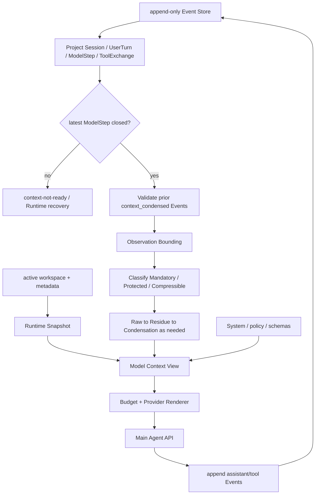
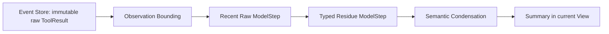

# Context Management v2 Technical Design

状态：Accepted Design；Phase A 已实现，Phase B/C 待实现
日期：2026-08-31
取代范围：Context v1 的 Active Code selection、active UserTurn 历史保留和仅按 completed UserTurn 淘汰策略
不取代范围：append-only Event、Event identity/projection、Runtime Snapshot、容量错误和 execution slice 已实现契约

## 1. 背景

Context v1 已实现 Event projection、Runtime Snapshot、Tool Result residue、Active Code、保守 token budget、completed UserTurn 淘汰和最低集合容量失败。五次 HTTPX 真实 Session 暴露两个问题：

1. Active Code 同一路径只保留最后 read range，后续小范围读取会撤走此前完整代码；
2. active UserTurn 的闭合 tool-call/result 持续累积，正文逐步 residue 化后，输入仍承担线性增长的协议 shell 成本。

OpenHands、SWE-agent 和 Aider 的源码调研表明，自动维护隐式源码集合不是 Agent 正常工作的必要条件。v2 采用更简单的语义：**Context 只展示真实 Event 的近期 Observation 和可审计的历史降级结果；精确源码需要时重新读取。**

## 2. Goals / Non-Goals

### 2.1 Goals

- Event Store 与单次主 Agent API 的 Model Context View 完全分离；
- 移除隐式 Active Code，不产生第二份源码事实；
- 把 Event 确定性投影为 `Session → UserTurn → ModelStep → ToolExchange[]`；
- 在 closed ModelStep 边界内安全降级 active UserTurn 历史；
- 明确 Observation Bounding、Typed Residue、Semantic Condensation 三种不同机制；
- 保留近期操作的足够原文，并在 provider 上限前主动收缩；
- 输出可解释 BudgetReport，从 append-only Event 确定性重建 View。

### 2.2 Non-Goals

- 自动判断“重要源码”；
- repository semantic index、embedding、RAG 或 RepoMap；
- 隐式 Working Set 或 Active Code cache；
- Task State；
- LangGraph 或其他 Agent 编排框架；
- 以 summary 代替当前文件、Git tree、Candidate revision 或 validation evidence；
- 保证模型不发生任何重复读取；
- 为未来 provider 预设尚未使用的 reasoning-group 抽象。

## 3. 设计原则

### 3.1 Environment truth is re-readable

源码、配置和测试属于 active workspace 的当前环境事实。历史 `read_file` 只证明某一 SHA、某一范围曾被返回；它不保证正文永久进入输入，也不保证文件仍未变化。

### 3.2 Event is durable, View is derived

`events.jsonl` 保存完整、append-only 的事实序列。Model Context View 是每次主 Agent API 调用前的临时投影，可以降级旧历史，但不能修改原 Event。

### 3.3 Recent exact, old structured, older semantic

近期 ModelStep 使用有界原始 Tool Result；更旧 ModelStep 把 Tool Result payload 替换为 typed residue；协议 shell 仍过大时，合法旧前缀才由 semantic summary 取代。模型需要精确代码时重新调用工具。

### 3.4 Compress only at closed ModelStep boundaries

同一主 Agent assistant response 产生的全部 ToolCall 属于一个 ModelStep。历史 manipulation 只能切在 closed ModelStep 之间，不拆 assistant call batch，也不拆 ToolCall 与 terminal outcome。

### 3.5 Derived summaries never override runtime truth

summary 可以表达历史进展，但 Runtime Snapshot 始终覆盖其中的旧 workspace、revision、changed paths 和 validation 陈述。

## 4. Authority 与生命周期

| 层次 |内容 |生命周期 |权威性 |
| --- | --- | --- | --- |
| Event Store | User/Assistant、ToolCall、ToolResult、Approval、控制 Event | Session 持久 |历史事实权威 |
| Runtime Snapshot | workspace、revision、tree、changes、validation、environment |每次构建重算 |当前 Runtime 真相 |
| Context Condensation |覆盖范围、digest、summary、版本与原因 |可持久派生 Event |仅控制 Model Context history projection |
| Model Context View | instructions、snapshot、历史、raw observation、residue、summary |单次主 Agent 请求 |非持久派生 |
| Provider Messages | provider 所需合法 wire shape |单次请求 | transport 对象 |

不存在 Active Code 或长期代码正文副本。

## 5. 核心投影模型

### 5.1 层级

```text
Session
└── UserTurn
    └── ModelStep
        └── ToolExchange[]
```

- **UserTurn**：从一个用户输入开始，到主 Agent terminal/final response 或明确终止为止。
- **ModelStep**：主 Agent 的一次 assistant response，即一次主 Agent model API 调用的结果。
- **ToolExchange**：一个 ToolCall 与其唯一 terminal ToolResult、denial 或 protocol error。
- 同一 assistant response 的多个 ToolCall 属于同一个 ModelStep。
- 无 ToolCall 的 terminal assistant response 也是一个 closed ModelStep。

Semantic summarizer/condenser 调用不属于主 Agent trajectory：不分配 `model_step_id`，不生成 AgentStep/ModelStep，只产生具有自身 Event identity 与 condensation metadata 的 `context_condensed` 派生 Event。

### 5.2 Closed ModelStep

ModelStep 在 assistant response 无 ToolCall，或每个 ToolCall 恰好有一个 terminal outcome 时 closed。投影不变量：

- 每个 `call_id` 恰好对应一个 ToolCall；
- 每个 ToolCall 恰好对应一个 terminal outcome；
- orphan ToolResult、重复 ToolCall 或重复 terminal outcome 导致 projection failure；
- 最小 manipulation atom 是一个 closed ModelStep；
- cut 只允许出现在 closed ModelStep 之间。

### 5.3 Open ModelStep

正常的下一次主 Agent API 请求前不应存在 open ModelStep：

```text
open ModelStep
→ context-not-ready / recovery state
→ Runtime 完成 tool execution 或 atomic recovery
→ ModelStep closed
→才可准备下一次主 Agent request
```

Open ModelStep 永不可被历史降级。Context 层不补执行工具，也不伪造 terminal outcome。

## 6. 每次主 Agent API 调用



需要 semantic condensation 时，该构建迭代不调用主 Agent：

```text
prepare candidate Context for next Agent ModelStep
→ detect trigger and choose legal old prefix
→ call summarizer without model_step_id
→ append context_condensed Event
→ stop this build iteration
→ re-project Event Store
→ prepare and start the actual next Agent ModelStep
```

压缩是显式、可审计的派生状态转换，不在主模型请求中静默改写历史。

## 7. Model Context View 组成

```text
1. System Instructions
2. Tool Policy
3. Current Runtime Snapshot
4. Completed UserTurn history（summary/residue/minimal form）
5. Active UserMessage
6. Valid rolling Condensation Summary（如有）
7. Active UserTurn 较旧 closed ModelStep residues
8. Active UserTurn recent closed ModelStep raw messages/results
9. Current transient retry/protocol message
10. Tool Schemas（provider 独立参数）
```

Renderer 将逻辑块转换为 provider 合法 messages。View 不包含 `active_code`；Runtime Snapshot 不从历史 summary 复制状态。

## 8. 三阶段历史降级生命周期



这是逐级信息退化，不是五种同义的 compaction。Event Store 中的原始 Observation 始终保留。

### 8.1 Observation Bounding

Bounding 作用于**单个 ToolResult**，限制一次请求中展示的原始精确 body；结果仍是 raw observation，不是 residue。它保留截断标志、range、完整内容 SHA 和工具 metadata。

| Observation | v2 初始 View 上限 |必须保留的超限信息 |
| --- | ---: | --- |
| `read_file` | 16 KiB | `context_truncated`、requested/returned range、total、SHA |
| `search_text` / `find_files` | 16 KiB | query、mode、match/file count |
| `run_command` | 16 KiB | status、exit、changed paths、stdout/stderr tail |
| Git read | 16 KiB | operation、target、result size |
| edit |不重复内嵌 patch正文 | operations、result、revision |

16 KiB 沿用 v1 `_bounded_result()` 以减少迁移变量；它是单 Observation 字节上限，不是类别 token 配额。工具自身更严格的边界继续生效。

### 8.2 Typed Residue

Residue 作用于**更旧的 closed ModelStep 中的 ToolResult payload**，不调用 LLM：

```text
bounded raw ToolResult
→ keep assistant/tool protocol shell and pairing
→ replace result payload with typed residue
```

```json
{
  "tool": "read_file",
  "call_id": "call-...",
  "ok": true,
  "error_code": null,
  "content_retained": false,
  "omission_reason": "historical_reduction",
  "metadata": {}
}
```

`read_file` residue 保留 path、requested/returned range、total lines、has-more flags、完整 bytes SHA-256、可确定的 changed-since-read，并明确要求重新读取精确正文；不保留旧源码摘录。

其他 residue：search 保留 query/mode/path/count；command 保留 command/hash、cwd、purpose、status、exit、有限 tail 和 changed paths；edit 保留 operation/path/result/revision/失败目标；approval 保留请求能力与最终 decision/scope；Git read 保留调用类型、目标和结果规模。

### 8.3 Semantic Condensation

当旧 ModelStep 的 residue 与协议 shell 仍过大时，condenser 选择一个**连续、合法、较旧的 closed ModelStep 前缀**。当前 View 删除该前缀的 assistant/tool shell，以一个 summary block 取代；原 Event 不删除。

summary 包含原始目标与约束、调查过的文件/符号及结论、已完成动作、修改历史、执行过的命令及历史结果、未决问题和下一步。summary 不得宣称当前源码、workspace clean/dirty、candidate revision/tree、current validation 或 permission grant。

## 9. Active 与 Completed UserTurn

### 9.1 Active UserTurn

Active UserTurn 是当前请求尚无 terminal/final response 的 ReAct loop。其历史不是不可切割的大块：

```text
recent closed ModelSteps: bounded raw
older closed ModelSteps: typed residue
old legal prefix: semantic condensation
```

正常情况下尽量保留最近 `preferred_recent_raw_steps=4` 个 closed ModelStep。最近一次 failure、edit 和 validation 可获得额外有限保护。这些都是 preferred/protected，不是 mandatory；hard pressure 下仍允许 raw → residue，不能为数量目标突破 provider budget。该值在 HTTPX 复测后调整。

### 9.2 Completed UserTurn

Completed UserTurn 已有 terminal/final assistant response，其内部 trajectory 优先降级为：

```text
UserMessage
+
Final Assistant response
```

之后还可进入跨-turn semantic condensation。Completed 不等于语义失效：continue、approval 或补充约束可能延续同一逻辑任务，因此只能“优先压缩”，不能一律删除。本轮不引入 Task State。

## 10. `context_condensed` Event

### 10.1 Schema 与作用域

```json
{
  "type": "context_condensed",
  "payload": {
    "covered_from_seq": 120,
    "covered_to_seq": 248,
    "covered_event_ids_sha256": "...",
    "summary": "...",
    "reason": "tokens",
    "input_estimated_tokens": 22410,
    "target_tokens": 11000,
    "algorithm_version": 1,
    "model": "..."
  }
}
```

- seq range 是生成 condensation 所依据的原 Event 范围；
- digest 按范围内 ordered Event IDs 计算；
- condensation 只改变 **Model Context history projection**；
- Runtime、Candidate、Approval、Audit 等权威 projection 不因位于 covered range 而消失；
- 它不是 Event Store 的通用 tombstone，原 Event 始终存在；
- 范围、digest 或 algorithm version 校验失败时忽略该派生 Event，从原 Event fail-safe 重建。

### 10.2 Rolling condensation

```text
M1-M20 → Summary1
Summary1 + M21-M40 eligible history → Summary2
```

不在每次触发时重新把 M1-M40 全部原始消息发送给 summarizer。Summary2 记录扩展后的 earliest/latest covered seq、输入 summary identity/digest 和自身 algorithm version。有效的新 summary 在 View 中取代旧 summary及新增覆盖的历史；旧派生 Event 和原 Event仍留在 Store。

重建时按 Event 顺序验证 condensation 链：只采用 digest、范围和前驱 summary identity 均有效的最新 rolling summary；任一环节无效时忽略该环节及其后继，从最后有效 summary 或全部原 Event 重建。Runtime truth 永不由 summary 决定。

### 10.3 Failure

- soft trigger 下 summarizer 失败：继续 deterministic View；
- hard trigger 下失败：扩大 raw → residue 和 completed-turn degradation；
- deterministic reductions 仍不足：明确 `ContextBudgetExceeded`；
- 不删除 Event，不伪造 Assistant Final。

## 11. Budget 模型

### 11.1 Provider 容量

|参数 |默认值 |说明 |
| --- | ---: | --- |
| `context_limit` | 32,000 tokens | provider/model capability |
| `generation_reserve` | 4,000 |主模型输出预算 |
| `continuation_reserve` | 4,000 |下一次 continuation 余量 |
| `safety_margin` | 2,000 | tokenizer/JSON/schema 误差 |
| `usable_input_budget` | 22,000 |单次输入 hard limit |

v2 删除 `active_code_budget=4,000`；该空间回到统一动态预算，不分配给某一固定类别。

### 11.2 三级优先级

#### Mandatory

历史降级不能删除：System Instructions、Tool Policy、Tool Schemas、Current Runtime Snapshot、Active UserMessage，以及 provider 当前请求所需的最低合法信息。Mandatory 自身超过 hard budget 时抛出 `ContextBudgetExceeded`。

#### Protected / Preferred Recent

尽量保持 raw：最近一次 failure、最近一次 edit、最近一次 validation、最近 `preferred_recent_raw_steps` 个 closed ModelStep。只保护有限最近项；hard pressure 下仍可转 residue。

#### Compressible History

```text
older raw
→ residue
→ semantic condensation
→ completed-turn minimal form
```

BudgetReport 分别统计 Mandatory、Protected、Compressible token 使用，并记录 trigger、target、实际 reductions 和 estimator。

### 11.3 默认 trigger

|参数 |默认值 |
| --- | ---: |
| `soft_max_llm_events` | 80 |
| `hard_input_tokens` | 22,000 |
| `post_compaction_target_tokens` | 11,000 |
| `preferred_recent_raw_steps` | 4 |
| `minimum_compaction_progress` | 10% |

OpenHands 的 `max_size=80` 和约半容量目标仅提供实验起点。`preferred_recent_raw_steps=4` 是 CodeAgent 迁移基线，不等于 OpenHands 的 `keep_first=4`。这些值须由 HTTPX 复测校准。

11k 是总 API 输入目标。若 Mandatory 已超过 11k，则实际目标至少为 Mandatory 加尽可能保留的 recent history，但不得超过 22k。event-count 是 soft trigger，按压缩前可转换为 LLM message 的 Event 数计算；hard token trigger 必须通过合法 reduction 或明确失败解决。

## 12. 构建与降级算法

每次主 Agent API 调用前：

1. Project Event 为 UserTurn/ModelStep/ToolExchange 并验证唯一配对；
2. 若最新 ModelStep open，返回 context-not-ready，交 Runtime recovery；
3. 验证 rolling condensation 链并重建 Runtime Snapshot；
4. 对将展示的单个 ToolResult 执行 Observation Bounding；
5. 计算 Mandatory / Protected / Compressible BudgetReport；
6. 从最旧 eligible closed ModelStep 开始把 raw ToolResult 转为 residue；
7. 优先把 completed UserTurn 降级为 UserMessage + Final；
8. deterministic reduction 后仍触发且已启用 condenser 时，选择合法连续旧前缀生成 rolling condensation；本迭代不调用主 Agent；
9. 重新投影并构建 View，收缩到 11k 目标或达到可实现的最低值；
10. 最低合法 View 仍超过 22k 时抛出 `ContextBudgetExceeded`。

不得删除 Active UserMessage、拆开 ModelStep batch、拆开 ToolCall/outcome、用旧源码摘录替代 residue metadata、让所有历史 failure 永久受保护、用 summary 改写 Runtime Snapshot，或静默提高 context limit。

## 13. 容量保证边界

Context v2 **不保证永不发生 `ContextBudgetExceeded`**。它保证 active UserTurn 历史可以在合法 closed ModelStep 边界持续执行 `raw → residue → semantic condensation`，因此历史大小不再随 ModelStep 总数不可压缩地线性增长。

合理容量失败包括：Mandatory context 本身超限；单个当前 Observation 经 bounding 后仍使最低合法 Context 超限；semantic condensation 失败且 deterministic reductions 已不足；provider/schema/instruction 固定开销异常过大。

```text
v1: long active turn → protocol residue linear growth → eventually unavoidable failure
v2: long active turn → old raw → residue → summary → bounded working View
```

## 14. Resume 与 Failure Semantics

```text
load session/meta/events
→ Atomic recovery / workspace fail-closed gate
→ project UserTurn / ModelStep / ToolExchange
→ validate rolling context_condensed chain
→ rebuild Runtime Snapshot
→ build raw / residue / summary View
→ continue same UserTurn
```

|失败 |行为 |
| --- | --- |
| orphan/duplicate/open protocol | projection error 或 context-not-ready；Context 不补工具 |
| condensation cut 不合法 |选择下一个 closed ModelStep 边界；soft 场景可跳过 |
| summarizer 失败 |保留原 Event，改用 deterministic reduction 或容量失败 |
| condensation digest/version 不匹配 |忽略无效派生链并记录诊断 |
| token estimator 不可用 |沿用 UTF-8 保守 estimator |
|最低合法 View 超预算 | `turn_terminated(context_budget_exceeded)` |
|旧 read 正文已省略 |正常状态；Agent 可重新 `read_file` |

## 15. 目标代码结构

```text
codeagent/context/
    models.py          # UserTurn、ModelStep、ToolExchange、View、BudgetReport
    projector.py       # Event → hierarchy + closed detection
    observations.py    # bounding 与 typed residue
    condenser.py       # semantic condensation 与 rolling validation
    budget.py          #分类估算、trigger、reduction report
    renderer.py        # View → provider messages
    builder.py         #单次主 Agent request preparation facade
```

首轮允许保持文件较少，但职责接口必须可单测。不要为了未来 provider 新增未使用抽象。

删除目标：`ActiveCodeSlice`、`ModelCapabilities.active_code_budget`、`ContextManager._active_code()`、Runtime Snapshot 的 `active_code` JSON，以及相关测试和文档承诺。

## 16. Migration Plan

### Phase A：No Active Code Context Projection Baseline

- 删除 Active Code；
- 实现 Event → UserTurn → ModelStep → ToolExchange projection 和 closed detection；
- 实现 Observation Bounding、Recent Raw、Typed Residue；
- 在 active UserTurn 内按 closed ModelStep 边界安全降级；
- 立即运行 HTTPX fixture / 真实 case，验证无 Active Code + read-on-demand 是否修复 v1 failure。

### Phase B：Budget-driven deterministic compaction

- 实现 soft/hard token trigger；
- 实现 Mandatory / Protected / Compressible budget；
- 扩大 raw → residue、completed UserTurn degradation；
- 实现 BudgetReport、最低合法 View failure 与 Resume。

### Phase C：Semantic Condensation

仅在 deterministic reduction 仍不足时启用：summarizer、`context_condensed` Event、rolling summary、digest/version 与 failure fallback。Phase C 不阻塞 Phase A/B baseline 测试。

## 17. Test Plan

### 17.1 ModelStep boundary

- 一个 ModelStep 内 batch ToolCall 不被拆；
- 只有 closed ModelStep 是 manipulation boundary；
- open ModelStep 阻止主 Agent request 并进入 recovery；
- orphan/duplicate 明确失败；
- Context condensation 不产生 ModelStep。

### 17.2 Compression lifecycle

- raw observation → residue 不改变 Event Store；
- Observation Bounding 仍标记为 raw exact body；
- residue → summary 后旧 ModelStep shell 不进入 View；
- summary 后仍可从原 Event 重建；
- rolling condensation 可压缩旧 summary + 新 eligible history；
- semantic summary 不覆盖 Runtime truth。

### 17.3 Active / completed turn

- active turn 的较旧 closed ModelStep 可 residue/condense；
- completed turn 可降级为 UserMessage + Final；
- continue/approval 场景仍可保留相关 completed turn；
- 不需要 Task State 才能完成上述投影。

### 17.4 Budget

- 删除 Active Code 后不再计算 4k 独立预算；
- BudgetReport 分列 Mandatory / Protected / Compressible；
- 80 Event soft trigger、22k hard trigger、11k target 生效；
- `preferred_recent_raw_steps=4` 不是 hard minimum：构造最近 4 steps 无法同时装入 22k，确认继续 raw → residue；
- Mandatory 自身超限产生结构化 termination。

### 17.5 Long active UserTurn

构造 50+、100+ closed ModelStep，验证 Event Store 持续增长，而 Model Context View 经 old raw → residue → condensation 后不永久线性增长；只要 Mandatory/current observation 未超限，active UserTurn 可以继续。

### 17.6 HTTPX 验收

-小范围后续 read 不再隐式覆盖额外代码上下文；
-正文仍在 Recent Tool Context 时，相同 read 的立即重复显著减少；
-正文 residue 化后重新读取属于合理行为；
-模型不再用 `sed/cat` 绕过不稳定 Active Code；
-在 48 ModelStep、22k hard budget 内进入编辑和验证；
-记录首次 edit step、重复相同 read、输入 token 和最终结果。

## 18. Future Trigger：可选 Context Cache

只有在无 Active Code baseline、Recent Tool Context 和 condensation 稳定后，且真实 benchmark 证明对未变化相同代码的重复 retrieval 是显著费用、延迟或失败来源，才另写显式生命周期的 Context cache optimization 设计。不得仅因模型偶尔重新读取文件就恢复隐式源码集合。
