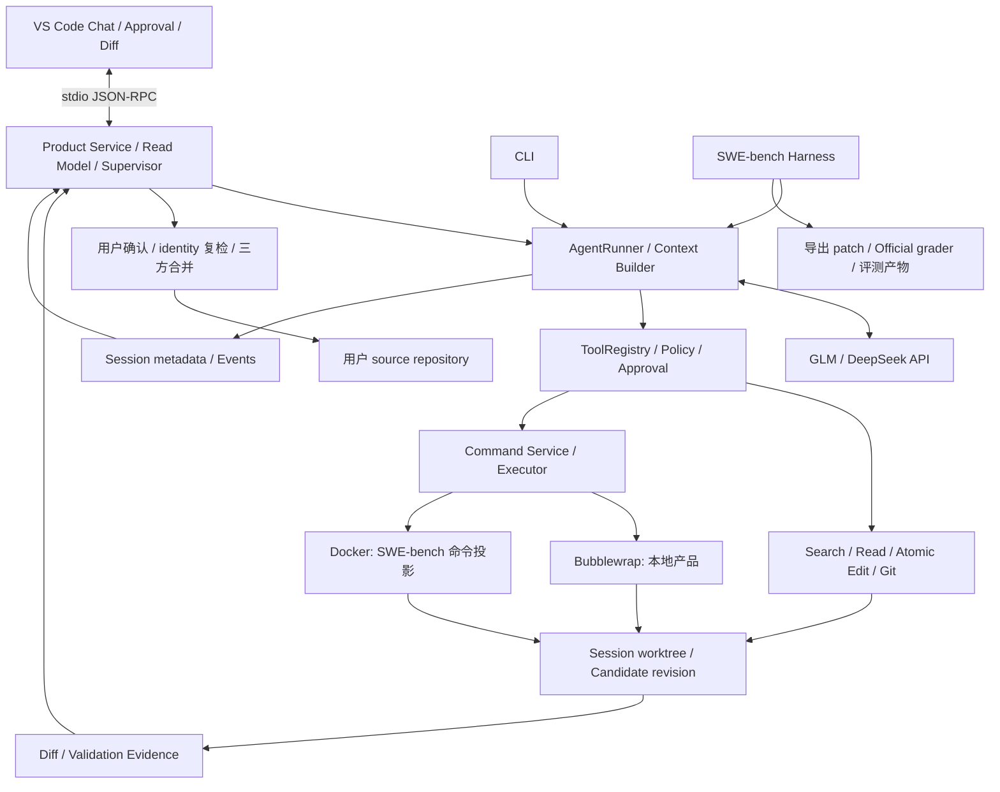

# 展示导向项目现状梳理

审查日期：2026-09-06；展示方案更新：2026-09-08。目标以 [系统目标](系统目标.md) 为准。
本文件记录展示交付差距，不是已发布版本声明。当前 GitHub 展示改为真实截图为主、少量短 GIF 补充交互。
具体素材见 [GitHub 展示素材清单](../examples/showcase/SHOT_LIST.md)。

## 1. 结论

当前已具备展示产品主链路的功能条件。项目最需要补的是截图、少量短 GIF、面向访客的 README，
以及冻结版本后的正式评测报告。无需先增加 Planner、共享项目理解或更多 Agent 能力。

Runtime + GLM 5.2 跑固定 50 题，能够产生适合简历的真实仓库工程指标；是否取得高 resolved rate 不能提前
保证。当前 harness 已能运行，但正式报告前仍有恢复身份、attempt 计量、时延和公开证据导出缺口。

## 2. 项目经历与实现逐项对齐

| 项目经历表述 | 当前证据/实现 | 展示时采用的准确口径 |
| --- | --- | --- |
| 自主实现 Tool Calling / ReAct 执行循环 | `runtime/runner.py`、`tools/registry.py`、正式工具及 Fake 测试 | 基于 Tool Calling 的观察—行动循环；不要求模型输出或展示隐藏推理 |
| Session–UserTurn–AgentStep | `session/`、`context/models.py`、`context/projector.py` | 使用实际名称 Session–UserTurn–ModelStep，工具交换为 ToolExchange；无独立 Task 实体 |
| 维护会话历史、活动代码和工具结果 | `context/builder.py`、Runtime Snapshot、有界 Observation、typed residue | 改为“从事件历史、运行状态和有界工具结果构造上下文”；无独立 Active Code/Working Set |
| 中断后的恢复 | SessionStore、workspace resume、执行切片 | 恢复会话与工作区；内部切片自动衔接；总预算用尽后可由用户明确扩额同一轮；不恢复崩溃前 shell/模型调用 |
| Git worktree + Bubblewrap / Docker | `workspace/git_worktree.py`、`runtime/sandbox_executor.py`、`benchmark/swebench_executor.py` | 本地产品用 Bubblewrap，benchmark 用 Docker projection；无 cgroup 配额或域名级 ACL |
| 冻结 Candidate Revision 并关联 Diff/Validation | Candidate revision/tree/policy evidence、accept freeze/三方合并 | revision 随修改推进，Accept 审查窗口冻结 patch；不描述成永久冻结的独立 Candidate 版本库 |
| 当前执行阶段、关键工具与命令状态 | `product/read_model.py`、`product/execution.py`、Extension 时间线 | 展示 running/awaiting approval/stopping 等客观状态与工具活动；无推测式语义阶段进度 |
| 暂停/继续、必要时接管 | cooperative Stop、自动切片、本轮扩额、进程内 Approval | 写为“安全边界停止、预算内自动执行、用户明确扩额、会话恢复和权限审批”；Stop 后以新 UserTurn 修正任务 |
| Candidate Accept / Reject | 原生 Diff、`changes/accept`、`changes/discard` | 代码交付使用 Accept/Discard；Reject 指权限拒绝，不混淆两个操作 |
| SWE-bench Task Source / Command Executor | `SWEbenchTaskSource`、`CommandExecutor`、Docker adapter、official grader | 可写“接入官方任务与评测环境”；Task Source 当前是 SWE-bench 数据/准备结构，不夸大为通用任务插件平台 |

“长任务可观测”已有执行切片、事件与控制机制支撑，但完成质量和长轨迹收敛性仍应由真实运行数据说明。
测试结果展示的是命令级状态、输出摘要和 validation，并非完整的测试用例级可视化平台。

## 3. GitHub 首页应当如何展示

建议按以下顺序组织 README；长篇 provider 配置与技术细节下沉到 docs。

| 顺序 | 首页内容 | 素材与作用 |
| --- | --- | --- |
| 1 | 标题、一句话定位、支持环境 | 清楚写明本地 Runtime + 远程模型 API、Linux/WSL2、Git 仓库 |
| 2 | 一张主截图 | 同时看见 Chat、工具活动、当前修改和中央原生 Diff |
| 3 | 4 个能力摘要 | Runtime/Context、隔离验证、可观测干预、真实仓库评测；每项链接代码/设计 |
| 4 | 快速安装和首个任务 | 固定版本 Runtime + VSIX；开发 F5 为单独入口；先给成功路径，再链接排错 |
| 5 | 一张架构图 | 突出事实来源、审批边界和两种执行后端，不画未实现模块 |
| 6 | 评测结果摘要 | 固定子集名称、模型/配置、resolved 分母、正常结束率、成本/时延，链接完整报告 |
| 7 | 关键设计与限制 | 为什么 worktree、为何验证会 stale、Stop 保证、支持范围和已知限制 |
| 8 | 开发与复现入口 | Quick Start、tests、人工验收、benchmark 命令、文档索引、版本与许可 |

可直接用于后续首页的架构骨架：

图中审批和交付是不同边界；benchmark 不经过产品人工 Accept 流程。实现细节以
[ARCHITECTURE](ARCHITECTURE.md) 为准。

## 4. 展示素材条件与缺口

| 项目 | 当前状态 | 发布前工作 |
| --- | --- | --- |
| 输入任务→读取→编辑→验证→Diff | Quick Start 已完成人工验证 | 截取主图，保留时间线、Current Delivery 和原生 Diff |
| 审批 Allow/Reject、Stop、Discard | Allow 已人工验证，其余有自动化覆盖 | 先截取 Allow 前的审批；Reject 通过后可补短 GIF |
| History 与重载恢复 | 已完成人工验证 | 截取列表，并录制 5～8 秒的会话切换 GIF |
| 网络/环境任务 | 已有专用 fixture，2026-09-06 Allow/Reject 有记录 | 作为可选进阶截图，与离线 Quick Start 分开展示 |
| 展示素材 | 仓库内还没有产品截图或 GIF | 使用真实 VS Code 画面，不用设计稿或生成图片冒充产品 |
| 安装分发 | 已有 manifest、RPC 入口、打包说明和 `.vscodeignore` | 干净安装 Runtime、生成 VSIX、验证无开发 `.venv` 兜底；提供版本和实际安装记录 |
| 自动化展示 | 当前工作区实跑 300 passed、3 skipped；Node render 测试通过 | 冻结 commit 重跑并记录；目前未找到仓库级 GitHub Actions workflow，可补 L0 CI |
| 许可与版本材料 | 扩展 manifest 声明 MIT，但未找到仓库级 LICENSE 或已跟踪发布包 | 确认许可文本与声明一致，准备 changelog/tag/release 材料；不据 manifest 宣称许可材料已完整 |
| 正式 50 题报告 | selection 已准备，未找到对应已完成模型 batch | 完成第 6 节评测前工作后运行并发布结果 |

### 展示素材分层

`codeagent-product-demo` 的零数量缺陷用于产品主图和 Quick Start。它离线、确定、容易复现，适合展示
隔离工作区、工具时间线、验证和原生 Diff。这些画面证明产品链路可用，不代表复杂仓库理解能力。

README 首轮只需要三张截图和一张短 GIF：

1. 主图同时展示 Explorer、原生 Diff 和 CodeAgent 时间线；
2. Approval 截图展示受保护操作如何等待用户决定；
3. History 截图展示本地会话列表；
4. 5～8 秒 GIF 展示从 History 直接进入所选会话。

Validation stale、Permission Reject 和 Accept/Discard 要等对应人工验收通过后再补素材。
任务执行等待、模型请求和测试过程不制作 GIF，也不需要剪成连续故事。

正式 50 题完成后，选择一个符合预定规则的真实仓库案例制作静态结果页。结果页包含任务来源、
关键代码位置、最终 Diff、official oracle 和该题在完整批次中的位置。单个案例不能代替总体评测。

完整文件名、配文和采集顺序见 [GitHub 展示素材清单](../examples/showcase/SHOT_LIST.md)。

### 现有 `examples/` 的使用方式

现有样例可以复用，但不把它们全部当成同一种展示材料：

| 素材 | 建议用途 | 是否适合作为 GitHub 主案例 |
| --- | --- | --- |
| `codeagent-product-demo` 离线除零任务 | 产品主图、Approval、History 和 Quick Start | 否，只证明产品链路可用 |
| `examples/buggy-repos/tiny-sort-bug` | readonly exploration 或开发冒烟；问题和仓库都过小 | 否 |
| `itsdangerous-strict-base64` | 真实模型截图和安装后验证；任务短且 oracle 明确 | 可作补充静态案例 |
| `click-short-help-sentences` | 中等复杂度完整流程；适合展示阅读现有实现、边界测试和最小 patch | 可作真实仓库静态案例 |
| `httpx-no-proxy-cidr` | 跨函数定位、IPv4/IPv6 边界和较完整回归；最能体现仓库理解 | 成功稳定时可作静态案例候选 |

`examples/eval-repos` 是上游快照，不直接在其中制作修改。继续通过 `examples/eval-tasks/prepare.sh` 生成独立 Git
workspace，并在静态案例中明确任务来源、基线和独立 oracle。三个任务属于项目自建真实仓库任务，不能表述成
SWE-bench 官方成绩。最终 GitHub 静态案例仍优先从冻结的 50 题正式批次中，按前述规则选择 oracle 通过的任务；
这样案例、逐题报告和简历指标可以指向同一份证据。若正式评测尚未完成，可暂时使用 Click 或 HTTPX 案例，
并准确标注为 real-repository dogfood。

### 素材制作顺序

1. 完成剩余人工验收，只为已经通过的行为制作素材；
2. 复用 Quick Start Session 截取主图和 History；
3. 新建 Session，停在 worktree Approval 截取审批图；
4. 录制 5～8 秒 History 切换 GIF，不录完整任务；
5. 把素材加入 README，并在正常 GitHub 页面宽度检查可读性；
6. 正式评测完成后再制作真实仓库静态案例页。

不要把未通过人工验收的状态放入展示，也不要用设计稿或生成图代替真实产品画面。

## 5. 50 题评测是否值得做

**值得，前提是把它作为固定真实仓库端到端基线，并公开方法和逐题证据。** 单个百分比的说服力有限；
与系统边界、成本、终止行为、失败分析一起报告，能支撑简历中的 Runtime 工程能力。

### 已有依据

- 历史 GLM 5.2 十题：oracle 8/10、正常结束 9/10、Context 超限 0、步骤耗尽 1、当前 validation 7/10。
  该集只有 6 Easy、4 Medium，不能外推新 50 题结果。
- 2026-09-04 两题 smoke：2/2 resolved，46/46 provider response 具有 usage；正式完成批次成本
  ¥3.556160。包含前次失败尝试的实际 API 总成本约 ¥5.500828，体现区分 attempt 消耗的必要性。
- `verified-eval-50-generation.json` 记录 selection 完成：19 Easy、26 Medium、5 Hard，覆盖 10 个仓库；
  排除开发十题，seed=42，单仓库上限 15 题，入选 50 题均通过 gold preflight。
- 这是按难度分层、仓库上限与环境准入约束生成的自定义子集，不是对全体题目的简单随机抽样。

SWE-bench Verified 官方集合为 500 题；官方 Docker harness 对提交的 patch 运行测试并给出 resolved 结果。
因此报告应命名为 **“SWE-bench Verified 自定义固定 50 题子集”**，不声称全量成绩、官方榜单成绩或跨系统
同条件排名。官方口径见 [Evaluation Harness](https://www.swebench.com/SWE-bench/reference/harness/)。

### 推荐汇报指标

| 指标 | 计算/解释 | 当前数据基础 |
| --- | --- | --- |
| Oracle resolved rate | 首次规定尝试中 official oracle passed 的题数 / 50；无有效判定单列，不能删出主分母 | result 与 batch summary 已有 |
| 正常结束率 | `agent_status=completed` / 50；模型正常结束不等于解决问题 | 逐题 result 已有；`completed_tasks` 只是 batch 处理完成数 |
| 完整交付链路率 | 正常结束 ∩ 非空 patch ∩ 当前 validation ∩ oracle passed 的题数 / 50 | 四项事实已有，需汇总交集；不代表 UI Accept 验收 |
| 失败分布 | Context 超限、step 耗尽、Runtime/API 错误、grader/environment 错误及 oracle 未通过 | result、task-state、trajectory 可提供；补统一分类，终止轴与 oracle 轴分开 |
| Token / API 成本 | 全部 attempt 总量、每题均值/中位数、总成本 / resolved 数；失败题成本也包含 | usage/cost 已有；失败 attempt 全量汇总仍缺失；resolved=0 时每成功题成本 N/A |
| 时延 | Agent 耗时与 grader/准备耗时分列，报告中位数/P90 和机器/并发/缓存条件 | 命令有时间字段；目前无逐题分阶段完整计时字段 |
| 执行轨迹 | 每题模型步骤、工具调用数、首次/最后修改与验证后的步骤数 | trajectory 已有主要字段，需形成可读报告 |
| 计量覆盖 | 含 usage 的响应比例、字段完整性、所有 attempt 的覆盖 | 已有 response usage 聚合；SDK 内部重试/未返回 usage 不应宣称精确覆盖 |

50 题每题对应 2 个百分点，几个任务的变化就会明显改变结果。主表写出分子/分母，并按难度/仓库附计数；
5 道 Hard 的结果只作描述，不得推断一般难题能力。无需为简历强行承诺置信区间或对全量 Verified 做统计外推。

一次固定模型配置足以支持“实现并验证端到端能力”。若要声称“上下文优化提升成功率/降低成本”，则需另做
同模型、同任务、同预算、仅改变目标机制的对照。当前不把额外付费对照列为展示前置条件。

## 6. 正式评测前必须落实的事项

以下是对当前代码的审查结论；本次只记录需求，没有实现这些补强。

1. **冻结并核对运行身份。** `manifest.py` 记录 Runtime commit/dirty；但
   `SWEbenchBatchRunner._validate_resume` 只校验 selection id/hash 与 model/config fingerprint，未强制校验
   Runtime commit、grader 配置或价格快照。正式运行应从干净的独立 checkout 开始，补充 resume 校验或在每次
   恢复前执行并保存等价的外部核对，避免不同代码结果混批。SDK/依赖版本与实际 provider 默认参数也要记录。
2. **定义并保存 attempt 账本。** batch 在未捕获异常时停止；恢复会跳过完整任务并重新运行不完整任务。
   `task-state.json` 会更新，旧 run 目录虽保留，当前 summary 只汇总最终纳入的 task result。需要报告层
   收集所有 attempt、异常和 usage；SDK 未提供计量的消耗保持未知，不能凭响应覆盖率称账单完全精确。
3. **预先固定重试规则。** Agent 已运行的首次 attempt 无论是否正常结束都保留，不因低质量 patch 重跑择优。
   grading 失败优先对同一 patch 重做 grader；必须重新生成时标为 recovery attempt，与首次结果分表。
   模型执行前的基础设施失败也记录，不把模型已执行的失败改记为未尝试。当前 batch 没有完整实现这套报告语义。
4. **明确时延与资源记录。** 逐 attempt 记录 prepare、Agent、grader 的开始/结束；batch 的
   `finished_at-started_at` 包含中断等待，不能冒充 Agent 延迟。补计时或用外部运行记录；历史 Event 推算的
   局部时间必须注明范围，不能编造缺失时长。
5. **提供公开证据映射。** `OracleResult` 有 report path，但 `SWEbenchRunResult` 未透传该字段；official
   文件保存在本地，完整 runs 被 gitignore。结果包需要按 instance/attempt 显式关联 prediction、patch hash、
   official report、trajectory、配置和计量，转换本机绝对路径并检查敏感信息；不提交 Docker image/cache。
6. **固定报告口径。** 发布逐题 CSV/JSON、结果摘要、至少一个成功与一个失败案例；明确模型 non-thinking、
   context/step/output budgets、命令限时、网络与权限策略、复现命令和价格来源。当前 benchmark 预建 worktree，
   使用 `AutoApprovalGate(False)` 拒绝需要额外审批的请求、Docker 网络关闭；它不测产品人工审批或 Accept。

以上可优先通过小型报告/运行检查补齐，不要求重构 Runtime。新增自动化能力应按项目规则补 pytest 与文档。
未修复前可以开发调试，但不直接把 `batch-summary.json` 作为完整正式审计报告。

## 7. 展示交付顺序

1. 收准项目经历措辞和 README 信息结构；本次先完成目标与现状文档。
2. 准备候选发布版本，完成干净安装/VSIX 体验、L0/真实 Bubblewrap/产品主链路验收；修复实际阻塞后冻结版本。
3. 基于稳定版本补充截图和短 GIF；安装步骤和 Quick Start 材料可先公开，不等待 50 题成绩。
4. 在正式付费运行前完成第 6 节准备；若修改了代码，冻结新的评测 commit 并明确与演示版本的关系。
5. 运行固定 50 题并生成可公开结果包，再把实际指标回填 README 与简历。

### 可采用的简历口径

> 自主实现可观测、可干预的本地 Coding Agent，提供 Tool Calling 执行循环、事件驱动上下文管理、Git
> worktree 隔离编辑、Bubblewrap 受控命令与验证证据；通过 VS Code 时间线、权限审批、安全边界停止和原生
> Diff 支持开发者审阅并采纳修改。接入 SWE-bench 官方 Docker 环境与 grader，在固定 Verified 50 题自定义
> 子集上使用 GLM 5.2（non-thinking，固定预算）取得 X/50 resolved、Y/50 正常结束，报告完整 API 消耗、
> 执行成本与失败分类。

X/Y 只能在正式运行后填写；成本未知时如实报告可计量部分。当前可写“已接入并完成真实任务 smoke”，不得
把已通过 gold preflight 的 50 题写成已完成模型评测。
