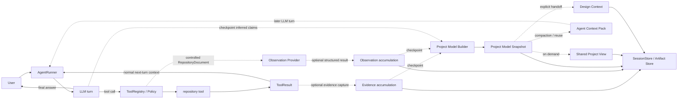

# Repository Understanding Technical Design

> **Historical design：** 本文记录截至 2026-08-24 的未实现方案。该方案因把代码理解、context engineering、Agent loop、artifact model 和交互视图混合得过重而停止推进，仅供历史参考。当前状态见[当前设计上下文](../PROJECT_GUIDE.md)。
>
> 原 Proposed Technical Design 下沉
> [Target Architecture](TARGET_ARCHITECTURE.md) 中的 Repository Understanding、Project Model 和
> Shared Project View 纵向切片。

## 1. 目标与边界

正常 repository understanding 继续使用现有 `AgentRunner` 的 ReAct tool loop：

```text
User
→ LLM
→ repository tool
→ ToolResult
→ next LLM turn / final answer
```

Evidence、Observation 和 Project Model 是该循环旁路积累和按需物化的表示能力，不是 ToolResult 返回 Agent 的必经中间件：

```text
ToolResult / RepositoryDocument
⇢ optional Evidence / Observation accumulation
⇢ valuable checkpoint: Project Model Snapshot
⇢ on demand: Shared Project View / Agent Context Pack / Design Context
```

第一版需要完成：

- Agent 在 token、文件数和工具调用预算内探索 Python repository；
- 在需要结构化复用时，用确定性分析旁路记录文件、symbol、import、代码范围和文本命中；
- 将代码事实、Agent 推断、用户补充、未来提案和开放问题分开保存；
- 在用户查看、协作或后续设计需要时，生成面向当前问题的局部视图，而不是展示完整代码图；
- 支持围绕视图继续解释、展开证据和触发新的只读探索；
- 支持用户加入尚未实现的模块，并明确标记为 Proposed；
- 将选定理解投影为后续 Technical Design 的输入。

第一版不负责：

- **构建跨 session 的长期项目知识库**；
- 自动还原完整或唯一正确的逻辑架构；
- 支持所有编程语言；
- 默认安装或托管 LSP、SCIP、CodeQL、向量数据库或图数据库；
- 自动批准用户提案，或把 Proposed 内容当成当前实现；
- change-impact prediction、代码修改或执行计划生成；
- 用单一分数证明用户已经“完全理解”项目；
- 以 VS Code 插件或完整 IDE 作为首版前置条件。

## 2. 完整验证用例

第一版以当前 CodeAgent repository 自身作为 fixture，完整用例不可缩减为单独的文件定位演示：

1. 用户让 Agent 解释“一次 readonly exploration 请求如何执行”；
2. Agent 通过现有 Runtime 只读能力探索仓库并生成局部系统视图；
3. 视图展示 `AgentRunner`、`Policy`、`ToolRegistry`、`SessionStore` 等组件和主要调用关系；
4. 用户选择一个组件，要求进一步解释；
5. Agent 展示推断以及支持它的文件、symbol 和代码范围；
6. 用户在视图中加入 Proposed `Repository Understanding` 模块；
7. 视图明确区分当前实现和拟议设计；
8. 用户询问该模块可能连接哪些现有组件；
9. Agent 基于证据给出建议，但将结果保留为 Proposed 或 Open Question；
10. 系统将当前视图投影为后续 Technical Design 的 Design Context。

步骤 1–5 验证 Understand，步骤 6–9 验证 Collaborate，步骤 10 验证 Carry Forward。三个阶段共享同一条 artifact lineage，不能各自维护项目事实。

## 3. 设计原则与 invariant

1. **所有 repository 读取都经过 Runtime。** Repository Explorer 复用 `ToolRegistry`、`Policy`、`PathGuard` 和当前 `WorkspaceContext`，不直接绕过安全边界扫描路径。
2. **Project Model 是快照，不是真理数据库。** 快照绑定 source identity；来源变化后必须重新验证或标记 stale。
3. **View 不是权威存储。** View 只引用 Project Model 中的 entity、relation、claim 和 evidence；布局状态不能暗中产生项目事实。
4. **事实、解释和未来设计分层。** Observed、Inferred、User-provided、Proposed、Open Question 不得静默互相转换。
5. **代码结论必须可追溯。** 正常 ReAct 回答至少引用可定位的 ToolResult、文件、symbol 或代码范围；内容进入 Project Model 后，Observed 和 Inferred claim 至少引用一个 evidence ID。证据不足时明确返回未知。
6. **追问不要求用户先纠正 Agent。** 用户可以要求解释、展开、比较或继续探索；纠正只是可选操作。
7. **用户提案不等于架构批准。** Proposed 内容只有进入后续 Design/Review 流程后才可能成为批准设计。
8. **快照和 revision 不原地改写。** Evidence 和 Observation 可以在探索过程中积累而不立即刷新 snapshot；checkpoint 物化的新 snapshot、用户补充、纠正或提案通过派生 revision 表达，并保留父版本。
9. **同一份模型服务两个消费者。** 需要生成 Agent Context Pack 或 Shared Project View 时，两者必须由同一 snapshot 投影，不能分别维护事实。
10. **预算影响完整度，不改变语义。** 达到预算时返回 partial 和未探索范围，不能把局部结果表述为完整仓库结论。
11. **Artifact capture must not unnecessarily serialize or interrupt the normal Agent exploration loop.** ToolResult 正常进入下一轮 Agent context；旁路捕获不能成为继续推理的同步前置条件。
12. **Explanation capability should remain available on demand.** 用户可以随时请求解释和证据，但 explanation artifact 不要求每轮生成或展示。
13. **Representation depth should scale with task complexity, collaboration need and risk.** 简单定位可以只保留 tool trace；需要复用、协作或进入设计时才提升为更深的结构化表示。

## 4. 逻辑组件与当前 Runtime 接入



实线主环表示正常 ReAct exploration。虚线支路表示可选的捕获、checkpoint 和 projection；它们不能阻止 `ToolResult` 正常进入下一轮。图中组件是逻辑职责，不要求一一映射为同名 Python 类。

| 逻辑职责                              | 复用的当前实现                          | 第一版新增责任                                                      |
| --------------------------------- | -------------------------------- | ------------------------------------------------------------ |
| Understanding Application Service | CLI、未来 application boundary      | 接收理解与交互命令，校验 snapshot version，协调探索、投影和持久化                    |
| Repository Explorer               | `AgentRunner`、只读 tools           | 保持 ReAct tool loop，维护探索预算和停止条件，不要求先构建 artifact                    |
| Observation Provider              | repository document               | 旁路将受控读取的内容转换为 typed Observation；不替代 ToolResult，首版内置 Python AST provider |
| Project Model Builder             | 无                                | 在 checkpoint 规范化 ID、连接 evidence，物化 immutable snapshot/revision       |
| Projector                         | `ContextBuilder` 的上下文入口          | 按需从 snapshot 生成 View Model、Agent Context Pack 或 Design Context          |
| Artifact persistence              | `SessionStore`、现有 `artifacts/`   | 保存 observations、snapshot、view、interaction 和 design context   |

### 4.1 不绕过 ToolRegistry

repository tool 的 `ToolResult` 由现有 Runtime 直接交给下一轮 Agent context，不以 Observation Provider 成功为前提。纯分析 Provider 是旁路能力：它可以接收已经由 Runtime 读取的 `RepositoryDocument`，但不自行打开任意路径，也不要求暴露成 Agent 可直接调用的 tool。

未来若需要批量索引器或外部进程，它必须注册为带明确 permission level 的工具，并接受 Policy、PathGuard、超时和输出限制。

首版不把 Python AST 做成外部插件。先定义 Provider contract；出现第二种语言或第二个精确分析器后，再验证是否需要通过 Python entry points 动态发现。

### 4.2 ContextBuilder 的变化边界

当前 `ContextBuilder` 主要重放最近 session events。第一版保留 ToolResult 的正常 next-turn 语义，并在确有 compaction 或复用需要时增加 Project Model context contribution：

- 新近且仍在 active context 中的源码和 ToolResult 正常全文参与下一轮，不要求先转换为 Observation 或 Context Pack；
- 只有已经存在 checkpoint snapshot，且旧源码/tool results 不再适合全文保留时，才投影当前问题相关的 Agent Context Pack；
- 保留完成 API tool-call 配对所必需的近期事件；
- 已由 Context Pack 表达的旧源码和 tool results 不再重复全文注入；
- active context 足够时不生成或注入 Context Pack；
- 原始 events 和 tool results 继续保存在 session 中用于审计，不因上下文压缩而删除。

### 4.3 当前实现必须补齐的接入缺口

Slice A 需要在不改变安全原则的前提下补齐以下能力：

- 当前 `fs_read` 的默认跳过目录包含 `codeagent/`，会使本项目自举 fixture 的 tree/search 遗漏主要源码；跳过规则应区分通用缓存/依赖目录与项目包名，不能硬编码当前项目名称；
- 当前 `search_text` 是逐文件、大小写敏感的字符串包含搜索；首版至少需要受控的多词/正则或 `rg` 等价检索，并继续遵守 PathGuard、敏感文件和输出上限；
- 当前 Git tools 只有 status 和 diff stat，不能产生完整 SourceIdentity；需要新增只读的 HEAD、工作区状态和 fingerprint 能力；
- 当前 `ToolResult.metadata` 是无 schema 的字典；Observation 不能只依赖约定俗成的 metadata key，需要 typed adapter 校验；
- 当前 `ContextBuilder` 固定重放最近 40 个事件，没有 artifact-aware projection；需要增加 Context Pack contribution 和旧探索结果压缩规则；
- 当前没有 Understanding artifact manifest 和恢复入口，需要复用 session artifact 根目录新增不可变 snapshot 存储。

这些是实现本设计所需的最小扩展，不授权 Repository Understanding 绕过现有工具、安全或 session 边界。

## 5. Artifact 与数据模型

### 5.1 公共 ArtifactEnvelope

所有新 artifact 共享以下字段：

| 字段 | 含义 |
| --- | --- |
| `artifact_id` | 不可变唯一 ID |
| `artifact_type` | observation set、project model、view、context pack 或 design context |
| `schema_version` | artifact schema 版本，不等于产品版本 |
| `session_id` | 所属 session |
| `created_at` | UTC 创建时间 |
| `created_by` | runtime、provider、model 或 user identity |
| `source_identity` | 生成时使用的 repository/workspace identity |
| `parent_artifact_ids` | 输入和派生来源 |
| `status` | `building / ready / partial / failed / stale / superseded` |
| `warnings` | 降级、预算耗尽和不完整范围 |

首版 artifact 保存在：

```text
<session>/artifacts/understanding/
├── observations/<observation-set-id>.jsonl
├── snapshots/<snapshot-id>.json
├── views/<view-id>.json
├── interactions/<interaction-id>.json
└── design-contexts/<design-context-id>.json
```

文件创建采用“写入临时文件、校验、原子替换或最终 manifest”的方式。失败构建不能覆盖最后一个 ready snapshot。

### 5.2 SourceIdentity

```text
SourceIdentity
├── workspace_key
├── source_root
├── active_root
├── workspace_kind
├── git_head                  # 非 Git workspace 可为空
├── base_commit               # execution worktree 可为空
├── workspace_state_digest
├── identity_strength         # strong / partial
└── observed_at
```

`workspace_state_digest` 在 Git workspace 中基于 HEAD、tracked diff 和允许观察的 untracked 文件状态计算；非 Git workspace 至少覆盖本次观察涉及的相对路径和内容摘要。每条代码 evidence 还保存自身 `content_digest`。

消费 snapshot 前重新计算 identity：

- HEAD、active root 或 workspace kind 不一致：snapshot 为 stale；
- 某条被引用 evidence 的内容摘要变化：相关 claim stale，snapshot 至少为 partial-stale；
- 无法计算完整 workspace digest：允许继续生成 artifact，但 `identity_strength=partial` 并显示 warning；
- stale snapshot 可以作为 historical context 查看，不能静默作为 current design evidence。

### 5.3 RepositoryDocument 与 Evidence

`RepositoryDocument` 是受控读取后的内部输入：

| 字段 | 含义 |
| --- | --- |
| `relative_path` | 相对 active root 的规范路径 |
| `language` | 已识别语言或 `unknown` |
| `content` | 受 Runtime 输出限制约束的文本 |
| `content_digest` | 内容摘要 |
| `truncated` | 内容是否被截断 |

`Evidence` 指向可供用户和 Agent 展开的具体依据：

| 字段 | 含义 |
| --- | --- |
| `evidence_id` | snapshot 内稳定引用 ID |
| `kind` | source range、text match、manifest、git state、tool result |
| `relative_path` | 可为空，例如纯 Git evidence |
| `range` | 1-based、end-inclusive 的行范围；无精确范围时为空 |
| `symbol_id` | 可为空 |
| `content_digest` | 生成证据时的内容摘要 |
| `origin_ref` | 产生该 evidence 的 tool event 或 Observation；直接捕获 ToolResult 时不要求先存在 Observation |
| `excerpt` | 可选、受长度限制的展示文本；不是权威源码副本 |

### 5.4 RepositoryObservation

Observation 表示 Provider 直接报告的结果，不包含高层架构结论：

```text
RepositoryObservation
├── observation_id
├── kind
├── subject_ref
├── object_ref / value
├── evidence_ids[]
├── provider
│   ├── name
│   ├── version
│   └── capabilities[]
├── reliability             # exact / syntactic / heuristic
└── warnings[]
```

首版 Observation kinds：

| Kind | Provider | Reliability | 说明 |
| --- | --- | --- | --- |
| `file_present` | filesystem | exact | 文件存在且可读 |
| `text_match` | lexical search | exact | 某字符串在某范围命中，不代表语义相关 |
| `symbol_defined` | Python AST | syntactic | class/function 定义与范围 |
| `contains` | Python AST/filesystem | syntactic | file/module/symbol 的包含关系 |
| `imports` | Python AST | syntactic | import 声明，不等于运行时一定加载成功 |
| `name_referenced` | Python AST | syntactic | 名称在语法树中被引用，不保证跨文件解析正确 |
| `call_syntax` | Python AST | syntactic | 存在调用表达式，不宣称目标已精确解析 |
| `git_identity` | git tool | exact | HEAD、base、workspace 状态 |

文本排序、模型相关性评分和 Repo Map rank 只用于候选选择，不生成 `depends_on` 等事实关系。

### 5.5 Entity、Relation、Claim

首版 Project Model 保持小型异构图：

| 类型 | 首版值 |
| --- | --- |
| Entity | repository、module、file、symbol、conceptual_component |
| Observed Relation | contains、imports、defines、name_references、call_syntax |
| Inferred Relation | depends_on、participates_in_flow、responsible_for |
| Proposed Relation | proposed_depends_on、proposed_participates_in_flow |

代码 entity ID 尽量由 `kind + canonical relative path + qualified name` 确定性生成。Conceptual component、用户补充和提案使用 artifact 内 ID，并通过 `evidence_refs` 或 `introduced_by` 关联来源。

`Claim` 保存人类可读的解释：

```text
Claim
├── claim_id
├── semantic_status          # observed / inferred / user_provided / proposed / open_question
├── statement
├── subject_refs[]
├── relation_ref             # 可为空
├── evidence_refs[]
├── confidence               # 仅 inferred 使用 low / medium / high
├── rationale                # inferred/proposed 使用
├── introduced_by
├── supersedes[]
└── stale_state
```

约束：

- Observed claim 不使用模型 confidence 掩盖证据类型，而读取 Observation reliability；
- Inferred claim 必须有 evidence refs 和简短 rationale；
- User-provided 内容不能自动升级为 Observed；
- Proposed 内容不能自动升级为 current；
- 相互冲突且无法验证的内容并存，并产生 Open Question；
- 纠正通过新 claim 和 `supersedes` 表达，不删除历史。

### 5.6 ProjectModelSnapshot

```text
ProjectModelSnapshot
├── envelope
├── question / purpose
├── scope
├── entities[]
├── relations[]
├── claims[]
├── evidence_index[]
├── exploration_summary
├── completeness
├── parent_snapshot_id
└── overlay_revision
```

第一版采用 session/task-scoped immutable snapshot。后续追问或补充产生派生 snapshot；不建设跨 session 自动合并。`completeness` 只描述本次 scope，例如 explored files、skipped paths、budget exhaustion 和 provider failures，不表示仓库整体理解百分比。

## 6. Observation Provider contract

逻辑接口：

```python
class ObservationProvider(Protocol):
    def describe(self) -> ProviderDescriptor: ...
    def observe(
        self,
        request: ObservationRequest,
        documents: Sequence[RepositoryDocument],
    ) -> ObservationBatch: ...
```

`ProviderDescriptor` 声明语言、capability、版本、是否需要外部进程和预期 reliability。`ObservationRequest` 包含 question、目标路径/symbol、请求 capability、source identity 和 budget。Provider 不接收未受约束的绝对路径。

第一版内置：

1. Runtime repository tools：目录、文件、文本和 Git evidence；
2. Python AST Provider：Python 3.11+ 的 symbol、import、contains、名称引用和调用语法；
3. LLM Inference：不是 Observation Provider；Agent 可以在探索结束或其他有价值的 checkpoint，基于已经积累的 evidence 结构化输出 Inferred Claim 并接受校验，不要求每次 Observation 后单独调用 LLM。

延期能力：

- Tree-sitter：多语言 parser/query adapter；
- LSP：按语言安装的精确 definition/reference/call hierarchy provider；
- SCIP：离线或 CI 产生的标准化 code-intelligence index；
- CodeQL：针对特定问题的可选高成本 provider。

某 Provider 不可用时返回 capability 缺失，不把结果伪装为空关系。Provider 失败不阻止正常 ReAct loop 或其他 Provider；如果此时请求 checkpoint，可以生成带 warning 的 partial snapshot。

## 7. Repository Explorer 与上下文选择

### 7.1 ReAct 探索与可选 checkpoint

```text
User question
→ LLM chooses repository tool
→ ToolResult enters next LLM turn
→ LLM answers or chooses another tool
→ repeat until answered, stopped or budget exhausted
```

Inventory、seed、retrieve、expand 和 inspect 是 Agent 可以按需选择或重复的探索活动，不是必须依次通过的状态机。自然语言不先进入独立的任务分类器；Agent 可以根据用户问题生成补充搜索词，但检索命中、读取范围和最终采用的 evidence 必须可审计。

探索过程中可以旁路积累 Evidence 和 Observation。出现以下 checkpoint 时，才考虑物化 Project Model Snapshot：

- 用户请求查看或共享项目理解；
- 后续轮次需要压缩并复用已经获得的上下文；
- 用户开始补充信息或讨论 Proposed Design；
- 当前理解需要进入后续 Design / Planning；
- 高风险任务需要保存可复查的结构化依据。

简单的文件定位、一次性解释或证据不足的短探索可以直接以 ReAct 回答结束，不要求生成 snapshot、view 或额外 explanation artifact。

### 7.2 Repository outline

第一版维护轻量、可缓存的 Repository Outline：

- 允许观察的文件路径；
- Python module、class、function 签名和范围；
- import 边；
- README、manifest、test 等重要文件标记；
- 与 source identity 绑定的缓存状态。

它可以作为便宜的全局上下文，但不是 Project Model。需要 outline 辅助探索或 context compaction 时，只选择与当前问题相关的部分；无明确焦点时才扩大 outline 预算。它不要求每轮重新生成或注入。

第一版排序顺序：

1. 用户或当前 view 显式选择的文件和 symbol；
2. 路径、文件名、identifier 的直接命中；
3. lexical search 命中；
4. 已命中节点的有限深度 import/containment 邻域；
5. README、manifest、入口和测试等重要文件。

不在第一版承诺 PageRank、embedding 或学习式 reranking。排序规则和每次选择理由写入 `exploration_summary`。

### 7.3 Budget 与停止条件

`ExplorationBudget` 至少包含：

- 最大模型/工具步骤；
- 最大读取文件数；
- 最大读取字符或估算 token；
- 最大候选节点数；
- 关系扩展深度；
- 单工具超时和总 elapsed time。

停止条件：

- 已找到回答当前问题所需的主要实体、关系和至少一组证据；
- 新一轮探索没有增加相关 evidence；
- 用户指定范围已经覆盖；
- 达到任一预算；
- Policy 拒绝、敏感文件或 provider 缺失使剩余问题不可验证。

达到预算时，正常 Agent loop 返回当前可支持的回答、限制和未探索范围。如果已经请求或存在 artifact checkpoint，则对应 snapshot 标记为 `partial`；停止探索本身不强制物化 snapshot。具体默认数值由实现前检索 spike 校准，保持配置化，不写死在 schema 中。

## 8. Projector：View、Context 与 Design Context

Projector 只响应明确的消费需要，不位于正常 tool loop 的同步主路径：用户没有查看/协作需求时不生成 Shared Project View；active context 尚可直接使用时不生成 Agent Context Pack；没有进入后续设计时不生成 Design Context。

### 8.1 ViewSpec

```text
ViewSpec
├── snapshot_id
├── focus_refs[]
├── purpose                 # explain_flow / explain_component / proposal_discussion
├── semantic_status_filter[]
├── relation_filter[]
├── max_nodes
├── max_depth
└── evidence_detail         # none / references / excerpts
```

### 8.2 SharedProjectView

View Model 与具体前端库解耦：

```text
SharedProjectView
├── view_id
├── snapshot_id
├── title / question
├── nodes[]
├── edges[]
├── ordered_flow[]
├── legend
├── selection
├── available_actions[]
├── warnings[]
└── presentation_state      # 可选布局，不含领域事实
```

节点和边必须携带 semantic status、claim/evidence 引用和可用操作。请求生成视图时，默认只显示任务相关的概念组件与关键关系；文件和 symbol 通过展开或 evidence panel 查看。

视觉语义保持稳定：

- Current Observed：实线、当前代码证据；
- Current Inferred：实线或浅色，显式标记 inferred；
- User-provided：独立来源标记；
- Proposed：虚线和 future/proposed 标记；
- Open Question：问号或 warning 标记；
- Stale：整体降级显示且禁止误认为 current。

首个交互 renderer 尚未决定，需要通过 UI spike 验证节点选择、证据展开和加入 Proposed 节点。Project Model 和 View Model 不依赖任何具体 renderer 的 node/edge schema。

### 8.3 AgentContextPack

Agent Context Pack 用于后续轮次的 context compaction / reuse，不是 View JSON 全量转储。只有旧源码和 ToolResult 不再全文保留在 active context、且已有可用 snapshot 时，才按预算输出：

- 当前 question 和 scope；
- focus entities 与简短职责；
- 相关 Observed/Inferred/Proposed claims；
- 关键 relations 或 ordered flow；
- evidence locator，而非默认附带全部源码；
- open questions、warnings 和 stale state；
- snapshot ID 和 source identity。

Context Pack 记录候选 evidence 和最终使用 evidence，便于区分“探索过”与“真正进入回答上下文”的内容。它替代对应的旧全文上下文，不与完整历史重复注入。

### 8.4 DesignContext

完整用例进入步骤 10 时，按需生成不可变 Design Context：

| 内容 | 规则 |
| --- | --- |
| 用户目标 | 保留原始问题和后续澄清 |
| Current components | 只引用 current claims |
| Evidence | 保留代码 locator 和 source identity |
| Inferences | 携带 confidence、rationale 和 evidence |
| Proposed design | 与 current 分层保存 |
| Open questions | 不补写未知答案 |
| Selected scope | 记录用户带入设计的 view/entity selection |
| Lineage | 引用 snapshot、view 和 interaction revisions |

Design Context 是下一份组件 Technical Design 的输入，不自动成为 Approved Design Snapshot。

## 9. 交互命令与版本语义

以下逻辑命令服务于显式的 artifact/view 协作流程，不是普通 ReAct repository exploration 的前置接口。首版可以由 CLI、测试 adapter 或本地 Web prototype 调用：

| 命令 | 主要输入 | 输出与行为 |
| --- | --- | --- |
| `create_understanding` | question、workspace、budget、requested outputs | 运行正常 ReAct 探索；在请求的 checkpoint 物化 snapshot，初始 view 为可选输出 |
| `get_view` | snapshot ID、ViewSpec | 纯投影，不重新读取 repository |
| `explain_selection` | snapshot ID、entity/relation ID、question | 从当前 snapshot 回答；证据不足时返回 exploration proposal |
| `expand_evidence` | snapshot ID、claim/evidence ID | 返回 locator 或受限 excerpt；stale 时警告 |
| `continue_exploration` | snapshot ID、question、scope、budget | 通过 Runtime 继续正常 ReAct 探索；积累 evidence，并在 checkpoint 生成派生 snapshot |
| `add_user_context` | snapshot ID、statement、targets | 生成 User-provided claim 和派生 snapshot |
| `add_proposal` | snapshot ID、entity/relation proposal | 生成 Proposed overlay revision |
| `explore_proposal_connections` | snapshot ID、proposal ID、question | 结合 current evidence 形成 Proposed relation/Open Question |
| `create_design_context` | snapshot ID、view ID、selection | 生成后续设计输入 artifact |

所有写入型交互都要求调用方提供基准 `snapshot_id`：

- 基准仍是 current：创建新 revision；
- 已有更新版本：返回 version conflict 和最新 ID，不静默覆盖；
- source 已 stale：允许添加纯 Proposed 内容，但必须保留 stale warning；任何声称 current 的新解释需要先 refresh；
- 用户说“加入一个模块”但无法判断是遗漏事实还是未来提案时，系统要求澄清，不自行选择语义。

`explain_selection` 首先查询当前 snapshot。如果现有 evidence 足够则直接回答；不足时明确建议或触发 `continue_exploration`。回答中必须区分“根据当前模型可回答”和“本轮新探索得到”。

## 10. 生命周期、恢复与失败语义

### 10.1 生命周期

```text
normal ReAct exploration
↳ optional evidence / observation accumulation
↳ checkpoint requested
→ building snapshot
→ ready | partial | failed
→ derived revision(s)
→ stale | superseded
↳ on-demand view / context pack / design context projection
```

正常 ReAct exploration 不依赖该 artifact 生命周期，也可以在没有 snapshot 的情况下完成回答。`partial` 是可消费的 snapshot 状态，但必须带 warnings；`failed` 表示本次 checkpoint 没有可用 snapshot，不否定已经完成的 tool loop；`stale` 仍可历史查看；`superseded` 表示已有后继 revision，不代表内容错误。

### 10.2 恢复

Session resume 时：

1. 读取最近的 ready/partial snapshot manifest；
2. 校验 schema version 和 artifact 引用；
3. 重新计算 source identity；
4. 恢复 view 和 interaction selection；
5. 若 stale，禁止将其作为 current context 静默注入模型；
6. 损坏的单个 view 不使 snapshot 失效，损坏的 snapshot manifest 则回退到上一可用 revision。

### 10.3 失败与降级

| 情况 | 语义 |
| --- | --- |
| 文件敏感或被 PathGuard 阻止 | 跳过并记录 unavailable evidence，不尝试绕过 |
| 单文件无法解析 | 保留 file/text evidence，跳过 AST observation，snapshot partial |
| Provider 不可用 | capability unavailable；其他 Provider 继续 |
| ToolResult 被截断 | evidence 标记 truncated，不用其证明超出范围的结论 |
| 达到预算 | snapshot partial，记录未探索范围 |
| 模型输出无 evidence 引用 | claim 拒绝进入 Inferred 层，或降级为 Open Question |
| source identity 变化 | snapshot stale；需要 refresh 才能产生新的 current claim |
| 用户补充与代码冲突 | 两者都保留，生成 Open Question，不修改代码事实 |
| Proposed 与 current 重名 | 保留独立 ID 和 semantic status，不合并 |
| View renderer 失败 | snapshot 仍可通过 CLI/JSON 消费，不影响权威 artifact |
| Design Context 生成失败 | 不影响已有 snapshot/view，可重试纯投影 |

## 11. 安全与隐私

- Repository Understanding 第一版只使用 `READ` 和已有 `EXEC_READONLY` 能力；
- 不启用 network，也不因分析器需要而放宽默认 Policy；
- 敏感文件规则同时作用于 inventory、search、read、outline、evidence excerpt 和 UI；
- artifact 不保存被拒绝文件的内容或可推断其秘密的摘要；
- 外部 Provider 将来必须声明进程、网络、安装和数据外发需求；
- View renderer 不直接读取 workspace，只通过 application boundary 消费 artifact；
- 用户在 View 中加入 Proposed 内容不会触发代码写入。

## 12. 技术选择

### 12.1 Adopt

| 选择 | 理由 |
| --- | --- |
| Python-only first slice | 当前项目为 Python 3.11+，能验证完整产品闭环而不引入多语言生命周期 |
| 标准库 AST | 无新增依赖，可提取 symbol、import 和精确范围；明确限制为 syntactic evidence |
| 现有文本/文件/Git tools | 已受 ToolRegistry、Policy 和 PathGuard 约束 |
| Agent 迭代探索 | 自然语言到代码定位需要查询改写、读取和证据充分性判断 |
| session/task-scoped immutable snapshot | 与当前 SessionStore 和 artifact 生命周期一致，避免过早建设全局知识库 |
| JSON/JSONL artifact | 便于审计、测试、恢复和 UI/Agent 双消费 |
| renderer-independent View Model | 防止前端库 schema 成为领域模型 |
| current + proposed overlay | 支持完整 10 步用例且不污染代码事实 |
| RepoQA Python 小子集 | 只作为经典 file/symbol localization 集成 smoke test |

### 12.2 Defer

- Tree-sitter 多语言支持；
- LSP/SCIP 精确语义 Provider；
- embeddings、semantic index 和学习式 reranking；
- 动态第三方 Provider discovery；
- 跨 session 长期 Project Model 合并；
- change-impact prediction；
- 多用户实时协作；
- IDE extension。

### 12.3 Reject for now

- 用向量数据库代替 Project Model；
- 用完整 AST/调用图直接作为 Shared Project View；
- 图数据库作为第一版前置依赖；
- 让 UI 或外部分析器绕过 Runtime 读取 repository；
- 将 LLM 架构总结保存为无 evidence 的 Observed 事实；
- 用 SWE-bench 最终修改成功率作为 Repository Understanding 的唯一指标。

## 13. Research Basis

本设计复用现有实践，不提出新的检索算法：

- [Aider Repository Map](https://aider.chat/docs/repomap.html) 和其
  [实现](https://github.com/Aider-AI/aider/blob/main/aider/repomap.py)：definition/reference tag、依赖图排序、mentioned file/identifier 个性化和 token budget；本设计采用“便宜全局 outline + 任务相关投影”，不承诺复制 PageRank。
- [Continue Codebase Awareness](https://docs.continue.dev/guides/codebase-documentation-awareness)：让 Agent 使用文件、搜索和 Git 工具持续探索；本设计复用工具探索模式，同时增加 typed artifact 和共享视图。
- [Sourcegraph Cody Context](https://sourcegraph.com/docs/cody/core-concepts/context) 与
  [Code Graph](https://sourcegraph.com/docs/cody/core-concepts/code-graph)：关键词搜索、代码搜索、定义/引用等 code intelligence 组合使用；本设计将精确 code intelligence 延期为 Provider。
- [GitHub Copilot Memory](https://docs.github.com/en/copilot/concepts/agents/copilot-memory)：repository fact 携带代码引用并在使用前验证；本设计采用 evidence citation、source identity 和 stale check。
- [Python AST](https://docs.python.org/3/library/ast.html)：首版确定性 Python 语法 evidence。
- [Tree-sitter Query](https://tree-sitter.github.io/tree-sitter/using-parsers/queries/1-syntax.html)、
  [LSP 3.17](https://microsoft.github.io/language-server-protocol/specifications/lsp/3.17/specification/) 和
  [SCIP](https://github.com/scip-code/scip/blob/main/docs/scip.md)：未来多语言或精确 symbol Provider 的依据。
- [Structurizr Dynamic View](https://docs.structurizr.com/dsl/cookbook/dynamic-view/) 与
  [Filtered View](https://docs.structurizr.com/ui/diagrams/filtered-view)：一个模型产生任务/状态相关的多个视图。
- [CodeSee Maps](https://docs.codesee.io/docs/explore-your-map)：折叠、过滤、查看代码和依赖导航等渐进展开交互。
- [React Flow](https://reactflow.dev/) 与 [Cytoscape.js](https://js.cytoscape.org/)：首个交互 renderer 的候选；领域 View Model 保持独立。
- [RepoQA](https://github.com/evalplus/repoqa)：首个经典自然语言到函数定位 smoke test，不作为新 benchmark 或产品价值总分。

## 14. 测试与验收

### 14.1 单元测试

- Python AST 对 class、function、import、contains、name reference 和行范围的提取；
- truncated/parse-error document 的降级；
- deterministic entity/evidence ID；
- Observed/Inferred/User-provided/Proposed/Open Question 类型约束；
- 无 evidence 的 Inferred claim 被拒绝或转为 Open Question；
- ViewSpec 过滤、深度、节点预算和 semantic status；
- Agent Context Pack token/字符预算；
- source identity 和 evidence digest stale detection；
- snapshot revision、version conflict 和 supersedes；
- Design Context 只包含选定内容且保留 lineage。

### 14.2 集成测试

- Explorer 只能通过受控 tools 获得 repository 内容；
- Policy 拒绝和敏感文件不会被 Provider 绕过；
- `AgentRunner → ToolRegistry → ToolResult → next Agent turn` 主路径不被 Provider 或 artifact capture 阻断；
- 在同一探索旁路上，Evidence/Observation 能按 checkpoint 物化 Snapshot，并按需生成 View；
- session resume 恢复最新可用 snapshot，并正确识别 stale；
- Provider 局部失败仍产生 partial snapshot；
- 旧探索结果被 Context Pack 压缩后，原始 events 仍可审计；
- UI/CLI command 始终绑定显式 snapshot ID。

### 14.3 Repository fixture

当前 CodeAgent repository 的固定断言至少包括：

- 找到 `AgentRunner.run_turn`、`ToolRegistry.get/call`、Policy evaluation 和 `SessionStore.append_event`；
- 不把 AST 观察到的 `.handler()` 直接宣称为已经精确解析的跨文件调用；
- 能形成 readonly request 的局部 ordered flow；
- 每个主要组件解释至少能展开到一个文件/symbol evidence；
- 加入 Proposed `Repository Understanding` 后不会出现在 current-only view；
- Design Context 同时保留 current evidence、proposal 和 open questions。

### 14.4 外部 smoke test

从 RepoQA Search Needle Function 中选取一个 Python repository 的小子集，记录：

- 目标 file/symbol 是否定位正确；
- 使用的工具调用、文件数和上下文量；
- 候选 evidence 与最终使用 evidence；
- 失败属于 retrieval、reading、synthesis 还是预算停止。

不进行算法排行榜声明，也不为此建设新的 benchmark。

### 14.5 人工完整场景

按第 2 节执行 10 步用例，观察：

- 用户是否能从局部视图解释关键流程；
- 是否能找到 Agent 判断的代码证据；
- 是否能通过追问获得更深解释；
- current、inferred、proposed 和 open question 是否容易区分；
- 用户是否能加入 Proposed 模块并讨论连接；
- 最终 Design Context 是否足以开始下一组件 Technical Design。

这是一项产品演示和形成性验证，不伪装成统计显著的人机 benchmark。

## 15. 实现切片

### Slice A：Understand（步骤 1–5）

- 保持 `AgentRunner → ToolRegistry → ToolResult → next LLM turn` 的现有 ReAct 主路径；
- artifact envelope、source identity 和 persistence；
- Repository Outline、检索预算，以及不打断主循环的 evidence capture；
- 旁路 Python AST Provider；
- checkpoint 驱动的 Project Model Snapshot；
- 按需 ViewSpec、JSON View Model 和用于 compaction/reuse 的 Agent Context Pack；
- CLI 或测试 adapter 的按需解释与 evidence 展开。

验收：简单探索可以不生成 artifact 直接完成；完整用例能够在 checkpoint 对当前 repository 生成 readonly execution 局部视图，并从主要结论导航到代码 evidence。

### Slice B：Collaborate（步骤 6–9）

- interaction command boundary；
- snapshot revision 和 version conflict；
- User-provided、Proposed、Open Question；
- current/proposed overlay；
- 首个交互 renderer；
- 证据不足时继续探索。

验收：用户加入 Proposed 模块、讨论连接并保持与 current implementation 的清晰区分。

### Slice C：Carry Forward（步骤 10）

- Design Context projector；
- selection、lineage 和 stale validation；
- 后续 Technical Design 的输入 contract；
- RepoQA 小子集和完整人工场景。

验收：从共享视图生成一份不补写未知内容、可追溯到 snapshot 和 evidence 的 Design Context。

三个 Slice 是同一纵向闭环的增量交付，不是三个独立产品。Slice A 的 schema 和接口必须支持 B、C，但不提前实现延期能力。

## 16. 实现前 Decision Gates

以下问题不阻止本文进入评审，但必须在对应 Slice 开始前关闭：

1. **检索预算默认值。** 用当前 repository 的固定问题 spike 校准文件数、字符/token、关系深度和停止阈值；schema 只定义配置项。
2. **首个 renderer。** 使用同一 View Model 验证候选 renderer 的节点选择、证据侧栏、current/proposed 样式和新增提案操作；本设计不预先指定实现。
3. **交互 transport。** Application command contract 先于 transport；Slice B 决定继续使用 CLI adapter，还是增加薄的本地 Web adapter。无论选择哪种，UI 不直接读取 repository。
4. **RepoQA 子集。** 固定 repository、case 和模型配置，保证结果可重复；它不阻塞 Slice A 的本地 fixture。

## 17. 与其他文档的权威关系

- 项目为什么存在、目标和非目标：[System Vision](../系统目标.md)；
- 当前逻辑目标架构和跨组件 invariant：[Target Architecture](TARGET_ARCHITECTURE.md)；
- 当前 v0.4 已实现结构：[Runtime Architecture](../ARCHITECTURE.md)；
- 当前设计状态：[Project Guide](../PROJECT_GUIDE.md)；
- 本纵向切片的输入输出、数据模型、接口、生命周期、失败和测试：本文。

本文中的组件和接口均为已停止推进的 Proposed Technical Design。代码行为与本文不一致时，当前实现事实以代码和 `../ARCHITECTURE.md` 为准；本文不得被用来声称 Repository Understanding 已经实现或仍是当前方向。
