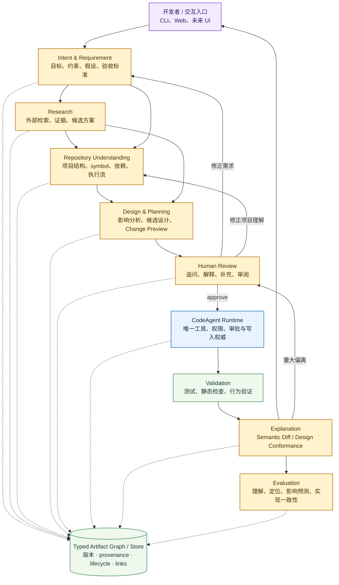
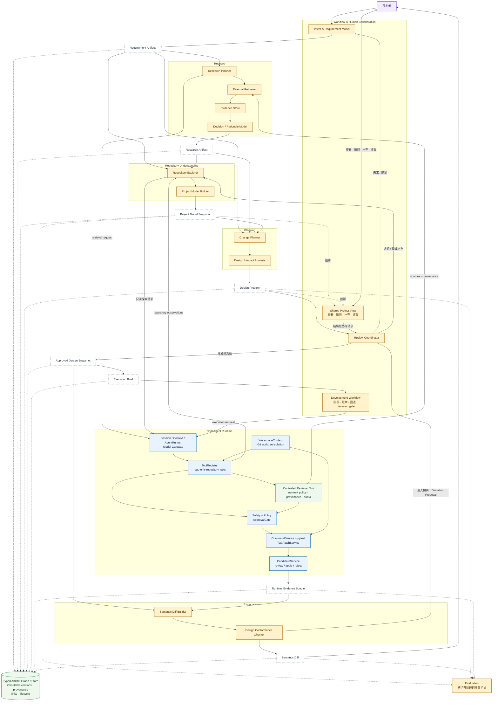

# Target Architecture

> **Historical design：** 本文记录截至 2026-08-24 的原目标架构。该方案因整体过重、混合过多职责而停止推进，不再是当前 Target Architecture 或实施依据。当前状态见[当前设计上下文](../PROJECT_GUIDE.md)。

本文基于 [System Vision](../系统目标.md)，描述当时设想的 CodeAgent 从 Coding Agent Runtime 向 Software Engineering Agent 演进后的目标架构。它表达历史能力边界和 artifact 流，不是当前代码目录的映射。

核心判断是：**保留现有 Runtime 作为唯一的工具、权限、审批、工作区和代码写入权威；在它前面新增 Research / Understanding / Planning 层，在它后面新增 Explanation / Evaluation 层。** 新层可以提出探索或执行请求，但不能直接读取越界内容、运行命令、修改 worktree 或写入 source。

## 阅读方式

目标架构使用两张图表达：

1. **System Overview**：描述整个开发生命周期及主要能力边界。
2. **Component & Artifact Architecture**：描述 Research / Understanding / Planning、Runtime、Artifact 和 Evaluation 之间的详细关系。

这样避免单张 Mermaid 图同时承载过多组件和横向关系，也方便未来分别演进。

## 1. System Overview

这张图只回答一个问题：

> **一个开发需求从提出，到调研、理解、设计、执行和验证，整体会怎样流过系统？**

其中：

- **Runtime** 仍然是唯一能够访问受保护资源、运行命令和修改代码的执行权威。
- Research、Understanding、Planning 等高层能力只提出请求或产生 artifact。
- Artifact Store 和 Evaluation 是跨阶段能力，而不是某一个单独步骤。

---

## 2. Component & Artifact Architecture

图例：

- **蓝色**：当前 Runtime 已有能力
- **绿色**：基于现有机制演进的基础设施
- **黄色**：System Vision 要求的新能力
- **白色虚线框**：跨阶段传递、可被开发者检查的 Artifact
- **紫色**：开发者或人工交互边界

### 两张图的职责

`System Overview` 用于解释系统的整体生命周期，应该保持稳定，不随具体实现细节频繁变化。

`Component & Artifact Architecture` 用于描述能力边界、Artifact contract 和组件依赖。随着具体 milestone 落地，可以逐步细化这一层。

后续如果某个区域进一步复杂，例如 Project Model 或 Research subsystem，应继续拆出独立子架构图，而不是持续扩大总图。

## Artifact 契约

Artifact 不是聊天摘要。每份 artifact 都应具备稳定 ID、类型、schema version、创建者、创建时间、输入 artifact 引用、source/workspace identity，以及 `draft / reviewed / approved / superseded` 等生命周期状态。确定性事实、外部证据、LLM 推断、用户提供的信息、未来 Proposal 和 Open Question 需要分开标注。

| 交接边界 | 传递的 artifact | 下游依赖它做什么 |
| --- | --- | --- |
| Intent → Research | Requirement Artifact | 确定需要外部验证的问题，避免无目标检索 |
| Research → Understanding | Research Artifact | 把外部约束、已有方案和不确定项带入 repo 分析 |
| Runtime → Understanding | Repository Observations | 提供实际文件、symbol、Git 和关系证据；Project Model 不能只来自模型记忆 |
| Understanding → Planning | Project Model Snapshot | 定位变更点、预测影响范围、展示当前 execution/data flow |
| Planning → Human Review | Design Preview | 让用户在 patch 出现前纠正需求理解、架构判断和修改范围 |
| Review → Runtime | Approved Design Snapshot + Execution Brief | 固定人工修正后的设计版本、允许范围、验证计划和必须重新 review 的偏离阈值 |
| Runtime → Explanation | Runtime Evidence Bundle | 用不可变 patch、receipt、测试结果和 trace 解释实际发生的修改 |
| Explanation → Human / Evaluation | Semantic Diff | 展示设计遵循情况、架构/行为变化、偏离和验证覆盖 |

## 关键边界

1. **Research 与 Understanding 不绕过 Runtime。** External Retriever 通过在 ToolRegistry 上扩展的受控 retrieval tool 访问网络，并接受独立的 network policy、source provenance 和配额约束；Repository Explorer 的文件与 Git 访问仍通过 ToolRegistry、PathGuard 和 Policy。当前默认拒绝网络的安全行为不应被高层组件直接关闭。
2. **Project Model 是带证据的快照，不是真理数据库。** 每条关系应标记来源、置信度和对应 source identity；代码变化后旧模型变为 stale，不能静默当作当前事实。
3. **批准的是版本化设计，不是一句“继续”。** 执行必须绑定确切的 Approved Design Snapshot。超出 allowed scope、改变关键 decision 或无法满足 acceptance criteria 时，产生 Deviation Proposal 并回到 Review。
4. **Execution Runtime 不吸收产品决策职责。** AgentRunner 负责模型/工具循环，Policy 决定能否执行；Workflow 决定现在处于哪个开发阶段，二者不能合成一个无法审计的自治 loop。
5. **现有安全闭环保持不变。** worktree 隔离、受控 pytest、受控文本 patch、Candidate freeze、source identity recheck 和显式 apply 仍是执行底座；新层不能直接写 source。
6. **Shared Project View 是 artifact 的投影，不是权威存储。** 它允许查看、追问、补充和表达 Proposed Design，但不能形成一套与 Project Model 冲突的隐藏事实。用户加入的内容必须区分“补充当前项目事实”和“提出未来设计”。当前阶段可以先由 CLI 或简单原型呈现，不以 VS Code 插件为前置条件；未来 UI 也只通过应用边界读取和更新 artifact。

## 与当前实现的关系

| 目标组件 | 当前基础 | 目标变化 |
| --- | --- | --- |
| Session / execution evidence | `SessionStore`、append-only events、command/edit/candidate/apply artifacts | 增加 typed artifact、版本、provenance 和跨 artifact link |
| Read-only repository access | `fs_read`、`git_read`、`ToolRegistry`、`PathGuard` | 在其上构建结构化 Repository Observations 和 Project Model，不复制一套读取权限 |
| Controlled execution | `AgentRunner`、Policy/Approval、worktree、pytest、text patch、Candidate | 接收 Execution Brief，并记录 design version 与 deviation |
| Validation | pytest receipt、Candidate test evidence | 扩展为 acceptance criteria mapping 和多类 validation evidence |
| Research | 无 | 新增 planner、受控 retriever、evidence/provenance 模型 |
| Understanding | 临时模型上下文与只读工具结果 | 新增可持久化、可纠正、可失效的 Project Model |
| Planning / Review | 用户消息和最终 Candidate review | 新增 Design Preview、Decision/Rationale、批准版本和 deviation gate |
| Explanation / Evaluation | diff、trace、receipt 等底层证据 | 新增 Semantic Diff、traceability 和质量指标 |

## 当时的设计入口

当时选择的首个下沉方向是 Repository Understanding、Project Model 和 Shared Project View 之间的纵向切片。它不再代表当前优先级。

当时的目标、验证场景和评估边界保存在[原设计上下文](PROJECT_GUIDE_REPOSITORY_UNDERSTANDING.md)，已下沉方案见 [Repository Understanding Technical Design](REPOSITORY_UNDERSTANDING_TECHNICAL_DESIGN.md)。两者均为历史材料。
